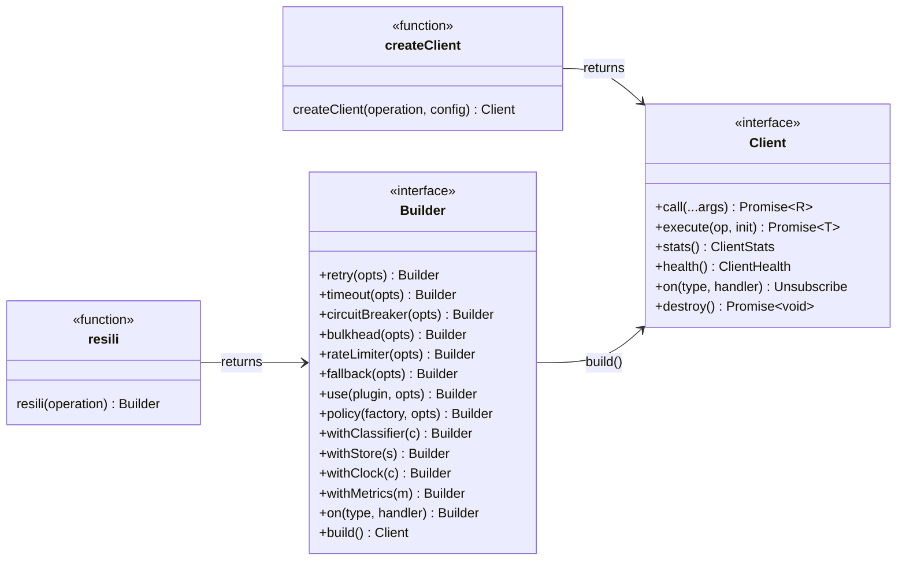
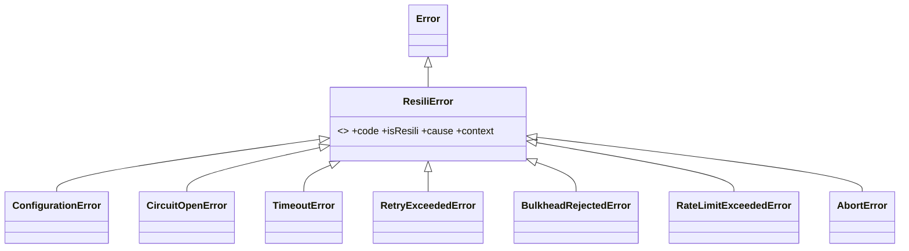
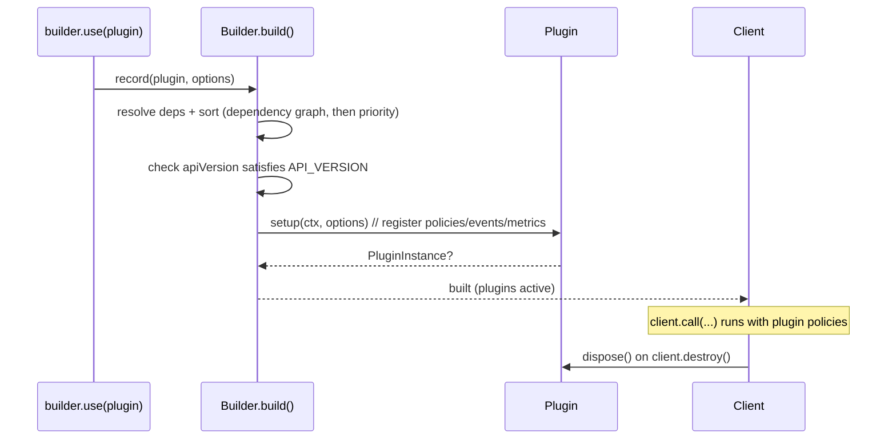

# Resili — Public API Specification

> **Status:** Draft for ratification (API freeze candidate)
> **Type:** Public API Contract
> **Stability target:** Stable for 5+ years under SemVer
> **Companion:** Implements the surface defined in [`ARCHITECTURE.md`](./ARCHITECTURE.md). Where the two disagree, this document governs the *public surface*; the architecture governs *internal behavior*.

This document defines the **complete public API** of `@resili/core` and the contracts every adapter, plugin, and custom policy must honor. Anything not explicitly exported here is **internal** and may change in any release.

> **Code blocks:** TypeScript blocks are **type/interface contracts** (declarations only — no bodies). Blocks under "Examples" are **consumer usage** of the public API, not library implementation.

---

## Table of Contents

1. [API Design Principles](#1-api-design-principles)
2. [Public Entry Points](#2-public-entry-points)
3. [Builder API](#3-builder-api)
4. [Client API](#4-client-api)
5. [Configuration Objects](#5-configuration-objects)
6. [Error API](#6-error-api)
7. [Event API](#7-event-api)
8. [Metrics API](#8-metrics-api)
9. [Plugin API](#9-plugin-api)
10. [Custom Policies](#10-custom-policies)
11. [Extension Points](#11-extension-points)
12. [Public Types](#12-public-types)
13. [Deprecation Policy](#13-deprecation-policy)
14. [Naming Guidelines](#14-naming-guidelines)
15. [Examples](#15-examples)
16. [FAQ](#16-faq)
17. [API Review](#17-api-review)

---

## 1. API Design Principles

| Principle | What it means for Resili | Concrete rules |
|-----------|--------------------------|----------------|
| **Simplicity** | The 80% case is one expression. | `resili(fetch).retry().timeout(3000).build()` must work with zero required options. Every option has a sane default. |
| **Discoverability** | The type system teaches the API. | Fluent builder returns a typed `Builder`; IDE autocomplete reveals the next legal step. No "magic strings" without a typed union. |
| **Type Safety** | No `any` in the public surface; generics flow end-to-end. | `resili(fn)` preserves `fn`'s argument and return types through to `client.call(...)`. All options are typed; invalid combos fail at compile time where feasible, else at `build()`. |
| **Fluent APIs** | Chaining reads top-to-bottom as policy intent. | Builder methods are chainable and order-insensitive (canonical order is enforced internally — see [§3.4](#34-ordering-independence)). |
| **Immutable configuration** | A built `Client` cannot be reconfigured. | `build()` deep-freezes config. Reconfiguration = rebuild. Runtime state lives in the `StateStore`, not the client surface. |
| **Backward compatibility** | Adding never breaks; removing waits for a major. | New options are optional. New events/metrics are additive. See [§13](#13-deprecation-policy). |
| **Zero surprises** | Defaults are safe and least-astonishing. | Retry is **off by default** for non-idempotent ops; timeouts do not silently swallow; errors are typed and never stringly. No global mutable singletons. |
| **Semantic Versioning** | Predictable evolution. | `MAJOR.MINOR.PATCH`. Breaking public-API change → MAJOR. Additive → MINOR. Fixes → PATCH. The "public API" is exactly what this document lists. |

### Why these, and the trade-offs we accepted

- **Fluent over config-object as the *primary* surface**, but we ship *both* (`resili()` and `createClient()`). Fluent wins for discoverability and progressive disclosure; config-object wins for serialization/DI frameworks (NestJS, declarative config). Shipping both costs a little surface area but removes a whole class of "I wish it were declarative" friction. See [ADR in §3.1](#31-alternatives-considered).
- **Order-insensitive builder**: users chain in whatever order reads best; the pipeline always composes in the canonical order from the architecture. This prevents the #1 resilience foot-gun (wrong nesting) without taking away fluency.
- **Off-by-default retries**: a 1M-downloads library must not silently double-submit POSTs. Safety beats convenience.

---

## 2. Public Entry Points

### 2.1 The export map

```ts
// @resili/core  — the single public entry point
export { resili, createClient } from './factory';
export type { Builder, Client, ClientStats, ClientHealth } from './client';
export type { Context, ContextInit } from './context';

// Configuration types
export type {
  RetryOptions, CircuitBreakerOptions, TimeoutOptions,
  BulkheadOptions, RateLimiterOptions, FallbackOptions,
  MetricsOptions, EventOptions, ResiliConfig,
} from './config';

// Errors (classes — runtime values)
export {
  ResiliError, ConfigurationError, TimeoutError, CircuitOpenError,
  RetryExceededError, BulkheadRejectedError, RateLimitExceededError, AbortError,
} from './errors';
export { isResiliError } from './errors';

// Failure classification
export type { FailureClassifier, Outcome, FailureVerdict } from './classification';
export { httpClassifier, composeClassifier } from './classification';

// Events
export type {
  ResiliEvent, ResiliEventType, ResiliEventMap, EventHandler, Unsubscribe,
} from './events';

// Metrics
export type { MetricsRecorder, Counter, Gauge, Histogram, Labels } from './metrics';
export { noopMetrics } from './metrics';

// State + time (extension contracts)
export type { StateStore, PolicyState } from './state';
export { memoryStore } from './state';
export type { Clock } from './time';
export { systemClock } from './time';

// Extensibility
export type { Policy, PolicyFactory, PolicyServices } from './policy';
export { definePolicy } from './policy';
export type { ResiliPlugin, PluginContext, PluginInstance } from './plugin';
export { definePlugin } from './plugin';

// Constants
export { POLICY_ORDER, API_VERSION } from './constants';
```

### 2.2 What is public vs internal — and why

| Symbol | Visibility | Reason |
|--------|-----------|--------|
| `resili`, `createClient` | **Public** | The two construction entry points. |
| `Builder`, `Client` (as **types**) | **Public types** | Returned by factories; not directly constructible by users (no `new`). Hiding the constructor lets us change construction internals freely. |
| Error **classes** | **Public values** | Users must `instanceof`-check and read properties. |
| `isResiliError` | **Public** | Cross-realm-safe guard (dual ESM/CJS can defeat `instanceof`). |
| `httpClassifier`, `composeClassifier` | **Public** | Default classifier + composition helper. |
| `memoryStore`, `systemClock`, `noopMetrics` | **Public** | Default implementations users can pass explicitly or replace. |
| `definePolicy`, `definePlugin` | **Public** | The sanctioned extension authoring helpers. |
| `Policy`, `PolicyFactory`, `PolicyServices` (types) | **Public types** | Custom-policy contract. |
| `POLICY_ORDER`, `API_VERSION` | **Public constants** | Ordering anchors and plugin compat checks. |
| Concrete policy classes (`RetryPolicy`, …) | **Internal** | Behavior is reached via builder/config; exposing classes would freeze internals. |
| `Pipeline` | **Internal** | Composition is an implementation detail; the `Client` is the contract. |
| Anything in `src/**/internal/**` | **Internal** | Not exported; no compat guarantees. |

> **Rule:** there is exactly **one** package entry (`@resili/core`). No deep imports (`@resili/core/dist/...`) are supported — the `exports` map blocks them. This keeps our refactoring freedom.



---

## 3. Builder API

### 3.1 Alternatives considered

| Alternative | Sketch | Verdict |
|-------------|--------|---------|
| **A. Fluent builder** *(selected, primary)* | `resili(fetch).retry().timeout(3000).build()` | ✅ Best discoverability; progressive disclosure; chainable. |
| **B. Config object factory** *(selected, secondary)* | `createClient(fetch, { retry:{...}, timeout:{...} })` | ✅ Great for DI/declarative config; ships alongside A. |
| C. Decorator-per-call | `withRetry(withTimeout(fetch))` | ❌ Nesting reverses reading order; ordering foot-gun; poor types. |
| D. Class + `new` | `new ResiliClient({...})` | ❌ Exposes constructor → freezes internals; no fluency. |
| E. Pipe operator style | `resili(fetch, [retry(), timeout()])` | ❌ Order becomes user's responsibility (the exact bug we removed). |

**Decision:** Ship **A (primary)** and **B (secondary)**; both produce the identical immutable `Client`. Reject C/D/E.

**Why both A and B?** They serve different audiences without diverging behavior: `createClient` is literally `resili()` with each option applied from a plain object. Maintaining one extra thin entry point is cheap; forcing fluent-only alienates the large NestJS/declarative-config cohort.

### 3.2 Signatures & generics

```ts
/** Any wrappable async operation; arg/return types are preserved end-to-end. */
type Operation<Args extends readonly unknown[], R> = (...args: Args) => Promise<R>;

/** Primary fluent entry point. */
function resili<Args extends readonly unknown[], R>(
  operation: Operation<Args, R>,
): Builder<Args, R>;

/** Secondary declarative entry point. */
function createClient<Args extends readonly unknown[], R>(
  operation: Operation<Args, R>,
  config?: ResiliConfig,
): Client<Args, R>;

interface Builder<Args extends readonly unknown[], R> {
  retry(options?: RetryOptions): this;
  timeout(options: number | TimeoutOptions): this;
  circuitBreaker(options?: CircuitBreakerOptions): this;
  bulkhead(options: number | BulkheadOptions): this;
  rateLimiter(options: RateLimiterOptions): this;
  fallback(options: FallbackOptions<R> | FallbackFn<R>): this;

  withClassifier(classifier: FailureClassifier): this;
  withStore(store: StateStore): this;
  withClock(clock: Clock): this;
  withMetrics(recorder: MetricsRecorder, options?: MetricsOptions): this;

  on<T extends ResiliEventType>(type: T, handler: EventHandler<T>): this;

  use<O>(plugin: ResiliPlugin<O>, options?: O): this;
  policy(factory: PolicyFactory, options?: unknown): this;

  /** Validates config (throws ConfigurationError) and returns a frozen Client. */
  build(): Client<Args, R>;
}
```

### 3.3 Method reference

| Method | Argument | Returns | Default if omitted | Notes |
|--------|----------|---------|--------------------|-------|
| `retry` | `RetryOptions?` | `this` | not applied | Off by default; safe-by-default for non-idempotent ops. |
| `timeout` | `number \| TimeoutOptions` | `this` | not applied | Number shorthand = `perAttemptMs`. |
| `circuitBreaker` | `CircuitBreakerOptions?` | `this` | not applied | Sensible production defaults when called with none. |
| `bulkhead` | `number \| BulkheadOptions` | `this` | not applied | Number shorthand = `maxConcurrent`. |
| `rateLimiter` | `RateLimiterOptions` | `this` | not applied | Options required (must pick a limit). |
| `fallback` | `FallbackOptions \| FallbackFn` | `this` | not applied | Function shorthand = `handler`. |
| `withClassifier` | `FailureClassifier` | `this` | `httpClassifier` | Replaces default classification. |
| `withStore` | `StateStore` | `this` | `memoryStore()` | Inject Redis/etc. for distributed state. |
| `withClock` | `Clock` | `this` | `systemClock` | Tests inject `FakeClock`. |
| `withMetrics` | `MetricsRecorder, MetricsOptions?` | `this` | `noopMetrics` | Wire Prometheus/OTel/etc. |
| `on` | `type, handler` | `this` | — | Build-time subscription (also available on `Client`). |
| `use` | `plugin, options?` | `this` | — | Register a plugin (see [§9](#9-plugin-api)). |
| `policy` | `factory, options?` | `this` | — | Register a custom policy (see [§10](#10-custom-policies)). |
| `build` | — | `Client` | — | Terminal. Idempotent per builder snapshot. |

> **Naming note — `circuitBreaker` vs `breaker`.** The original sketch used `.breaker()`. We standardize on **`circuitBreaker`** (full, unambiguous, matches the config type `CircuitBreakerOptions` and the architecture). `breaker` is **not** an alias — a single canonical name beats two. Brevity is recovered by autocomplete, not abbreviation.

### 3.4 Ordering independence

The builder records *intent*; the pipeline composes in the fixed canonical order from the architecture, regardless of call order:

```
Fallback → Retry → Circuit Breaker → Timeout → Rate Limiter → Bulkhead → Transport
```

```ts
// These two builders produce byte-for-byte identical pipelines:
resili(fetch).timeout(3000).retry().circuitBreaker().build();
resili(fetch).circuitBreaker().retry().timeout(3000).build();
```

Custom policies choose their slot via ordering anchors ([§10.4](#104-ordering)).

---

## 4. Client API

A `Client` is **immutable, reusable, and long-lived** — construct once per downstream dependency at module scope.

```ts
interface Client<Args extends readonly unknown[], R> {
  /** Invoke the wrapped operation with its native signature, through the pipeline. */
  call(...args: Args): Promise<R>;

  /** Run an arbitrary context-aware operation through the same pipeline & state. */
  execute<T = R>(operation: (ctx: Context) => Promise<T>, init?: ContextInit): Promise<T>;

  /** Snapshot of live execution counters plus reserved (currently empty) policy maps. */
  stats(): ClientStats;

  /** Health derived from available policy snapshot maps (not live built-in policy state yet). */
  health(): ClientHealth;

  /** Subscribe to events at runtime. Returns an unsubscribe function. */
  on<T extends ResiliEventType>(type: T, handler: EventHandler<T>): Unsubscribe;

  /** Release timers, listeners, and store handles. Idempotent. */
  destroy(): Promise<void>;
}
```

| Method | Purpose | Throws | Example |
|--------|---------|--------|---------|
| `call` | Primary execution path; preserves the wrapped function's types. | Any [Resili error](#6-error-api) or the operation's own error (when not handled by fallback). | `await client.call("https://api/x")` |
| `execute` | Run ad-hoc work (not the bound operation) with access to `Context` (signal, deadline). | Same as `call`. | `await client.execute(ctx => db.query(sql, { signal: ctx.signal }))` |
| `stats` | Observability/debugging; cheap synchronous snapshot. | never | `client.stats().totals.retries` |
| `health` | Probe endpoints; derived from policy snapshot maps (currently empty). | never | `app.get('/ready', () => client.health().status)` |
| `on` | Runtime event subscription (handlers are isolated). | never | `client.on('CircuitOpened', e => log(e))` |
| `destroy` | Cleanup for tests, hot-reload, and Lambda teardown. | never | `await client.destroy()` |

```ts
interface ClientStats {
  readonly circuit: Readonly<Record<string, { state: CircuitState; failureRate: number; calls: number }>>;
  readonly bulkhead: Readonly<Record<string, { active: number; queued: number }>>;
  readonly rateLimiter: Readonly<Record<string, { available: number }>>;
  readonly totals: { calls: number; successes: number; failures: number; retries: number };
}

type CircuitState = 'closed' | 'open' | 'half_open';

interface ClientHealth {
  readonly status: 'healthy' | 'degraded' | 'unhealthy';
  readonly openCircuits: ReadonlyArray<string>;
  readonly details: ClientStats;
}
```

**`stats()` (alpha):** `totals` (`calls`, `successes`, `failures`, `retries`) are live execution counters. `retries` counts extra attempts after the first (`RetryStarted` events), not total attempts. `circuit`, `bulkhead`, and `rateLimiter` are reserved policy snapshot maps and are currently always `{}` — built-in circuit breaker, bulkhead, and rate limiter runtime state is not wired into `stats()` yet.

**`health()` mapping:** `healthy` = no open circuits in the snapshot; `degraded` = any half-open circuit or queued bulkhead in the snapshot; `unhealthy` = any open circuit in the snapshot. Because those maps are empty, `health()` does not yet aggregate live built-in policy state and remains `healthy` until a snapshot hook exists.

`RequestStarted` / `RequestCompleted` are emitted once per top-level `call()`/`execute()`, wrapping the pipeline. Retry attempts emit `Retry*` events only. `RequestCompleted.errorCode` is present only for Resili errors.

---

## 5. Configuration Objects

General rules: every option is optional unless marked **required**; numbers are milliseconds unless suffixed; invalid values/combinations throw `ConfigurationError` at `build()` (never at call time).

### 5.1 RetryOptions

```ts
interface RetryOptions {
  maxAttempts?: number;            // default 3 (includes the first attempt)
  backoff?: 'fixed' | 'exponential'; // default 'exponential'
  baseDelayMs?: number;            // default 100
  maxDelayMs?: number;             // default 10_000 (per-delay cap)
  maxTotalDelayMs?: number;        // default 30_000 (retry budget)
  jitter?: 'none' | 'full' | 'equal'; // default 'full'
  factor?: number;                 // default 2 (exponential multiplier)
  retryOn?: RetryPredicate;        // default: classifier.isRetryable
  respectRetryAfter?: boolean;     // default true
  idempotentOnly?: boolean;        // default true (skip retry for non-idempotent ops)
}
type RetryPredicate = (outcome: Outcome, ctx: Context) => boolean;
```

| Field | Required | Default | Validation | Invalid combination |
|-------|:--------:|---------|-----------|---------------------|
| `maxAttempts` | no | `3` | `>= 1` | — |
| `baseDelayMs` | no | `100` | `>= 0` | `> maxDelayMs` → error |
| `maxDelayMs` | no | `10000` | `>= baseDelayMs` | — |
| `maxTotalDelayMs` | no | `30000` | `>= 0` | — |
| `factor` | no | `2` | `>= 1` | `backoff:'fixed'` + `factor` → error (`factor` only valid for exponential) |
| `jitter` | no | `full` | enum | — |

### 5.2 CircuitBreakerOptions

```ts
interface CircuitBreakerOptions {
  window?: { type: 'count'; size: number } | { type: 'time'; durationMs: number }; // default count/100
  failureRateThreshold?: number;     // default 50 (percent)
  slowCallDurationMs?: number;       // default 0 (disabled)
  slowCallRateThreshold?: number;    // default 100 (percent)
  minimumThroughput?: number;        // default 10
  resetTimeoutMs?: number;           // default 30_000
  halfOpenMaxCalls?: number;         // default 1
  successThreshold?: number;         // default 1 (consecutive half-open successes to close)
  key?: string | KeyResolver;        // default ctx.serviceName
}
type KeyResolver = (ctx: Context) => string;
```

| Field | Default | Validation | Invalid combination |
|-------|---------|-----------|---------------------|
| `failureRateThreshold` | `50` | `0 < x <= 100` | — |
| `minimumThroughput` | `10` | `>= 1` | `> window.size` (count window) → error |
| `successThreshold` | `1` | `>= 1` | `> halfOpenMaxCalls` → error |
| `halfOpenMaxCalls` | `1` | `>= 1` | — |
| `slowCallRateThreshold` | `100` | `0 < x <= 100` | set without `slowCallDurationMs` → error |

### 5.3 TimeoutOptions

```ts
interface TimeoutOptions {
  perAttemptMs: number;     // required (or via number shorthand)
  deadlineMs?: number;      // optional overall budget across all attempts
}
```

| Field | Required | Validation |
|-------|:--------:|-----------|
| `perAttemptMs` | **yes** | `> 0` |
| `deadlineMs` | no | `>= perAttemptMs` |

### 5.4 BulkheadOptions

```ts
interface BulkheadOptions {
  maxConcurrent: number;          // required (or number shorthand)
  maxQueue?: number;              // default 0 (reject when full; NEVER unbounded)
  queueTimeoutMs?: number;        // default 0 (no extra wait)
  key?: string | KeyResolver;     // default ctx.serviceName
}
```

| Field | Required | Default | Validation |
|-------|:--------:|---------|-----------|
| `maxConcurrent` | **yes** | — | `>= 1` |
| `maxQueue` | no | `0` | `>= 0` (no "infinite" sentinel permitted) |
| `queueTimeoutMs` | no | `0` | `>= 0`; requires `maxQueue > 0` |

### 5.5 RateLimiterOptions

```ts
interface RateLimiterOptions {
  strategy?: 'token-bucket' | 'sliding-window'; // default 'token-bucket'
  limit: number;                  // required: permits per interval
  intervalMs: number;             // required
  burst?: number;                 // token-bucket only; default = limit
  onLimit?: 'reject' | 'wait';    // default 'reject'
  maxWaitMs?: number;             // required if onLimit:'wait'
  key?: string | KeyResolver;     // default ctx.serviceName
}
```

| Field | Required | Validation | Invalid combination |
|-------|:--------:|-----------|---------------------|
| `limit` | **yes** | `>= 1` | — |
| `intervalMs` | **yes** | `> 0` | — |
| `burst` | no | `>= 1` | set with `strategy:'sliding-window'` → error |
| `maxWaitMs` | conditionally | `> 0` | `onLimit:'wait'` without `maxWaitMs` → error; `maxWaitMs` with `onLimit:'reject'` → error |

Wait mode waits for capacity using the injected `Clock` (no busy loop). Same-key waiters are admitted FIFO. If the next required wait exceeds the remaining `maxWaitMs` budget, the request is rejected immediately (`RateLimitExceededError`) instead of sleeping past the limit. Caller `AbortSignal` / context abort cancels the wait without consuming a token.

### 5.6 FallbackOptions / MetricsOptions / EventOptions

```ts
type FallbackFn<R> = (error: ResiliError | unknown, ctx: Context) => R | Promise<R>;
interface FallbackOptions<R> {
  handler: FallbackFn<R>;
  fallbackOn?: (error: unknown, ctx: Context) => boolean; // default: all errors
}

interface MetricsOptions {
  prefix?: string;                // default 'resili_'
  defaultLabels?: Labels;         // e.g., { env: 'prod' }
  enable?: ReadonlyArray<string>; // optional allow-list of metric names
}

interface EventOptions {
  buffer?: number;                // max queued events for async consumers; default 0 (sync)
  onHandlerError?: (err: unknown, event: ResiliEvent) => void; // default: count + swallow
}
```

### 5.7 Aggregate config (for `createClient`)

```ts
interface ResiliConfig {
  retry?: RetryOptions;
  timeout?: number | TimeoutOptions;
  circuitBreaker?: CircuitBreakerOptions;
  bulkhead?: number | BulkheadOptions;
  rateLimiter?: RateLimiterOptions;
  fallback?: FallbackOptions<unknown> | FallbackFn<unknown>;
  classifier?: FailureClassifier;
  store?: StateStore;
  clock?: Clock;
  metrics?: { recorder: MetricsRecorder; options?: MetricsOptions };
  events?: EventOptions;
  plugins?: ReadonlyArray<{ plugin: ResiliPlugin<unknown>; options?: unknown }>;
  policies?: ReadonlyArray<{ factory: PolicyFactory; options?: unknown }>;
}
```

---

## 6. Error API

All errors derive from `ResiliError`, carry a stable `code`, the ES2022 `cause`, and a `ContextSnapshot`. Use **`isResiliError(e)`** instead of `instanceof` across module boundaries (dual ESM/CJS can break `instanceof`).

```ts
abstract class ResiliError extends Error {
  abstract readonly code: ResiliErrorCode;
  readonly name: string;                 // matches class name
  readonly isResili: true;
  readonly cause?: unknown;
  readonly context?: ContextSnapshot;    // requestId, operationName, serviceName, attemptNumber
}
function isResiliError(e: unknown): e is ResiliError;
```



| Error | `code` | Thrown when | Extra properties | Retryable | Trips breaker |
|-------|--------|-------------|------------------|:---------:|:-------------:|
| `ConfigurationError` | `ERR_CONFIG` | At `build()` for invalid/contradictory options. | `field?: string` | n/a | n/a |
| `CircuitOpenError` | `ERR_CIRCUIT_OPEN` | Breaker open / no half-open permit. | `key`, `retryAfterMs` | No | No |
| `TimeoutError` | `ERR_TIMEOUT` | Per-attempt timeout elapsed. | `timeoutMs`, `attemptNumber` | Yes | Yes |
| `RetryExceededError` | `ERR_RETRY_EXCEEDED` | Attempts/budget exhausted. | `attempts`, `lastError` | terminal | terminal |
| `BulkheadRejectedError` | `ERR_BULKHEAD_FULL` | Concurrency + queue saturated. | `maxConcurrent`, `queueSize`, `waitedMs` | default yes | No |
| `RateLimitExceededError` | `ERR_RATE_LIMITED` | No token & wait exhausted. | `retryAfterMs` | yes | No |
| `AbortError` | `ERR_ABORTED` | Caller signal fired or deadline exceeded. | `reason` | No | No |

### Example

```ts
try {
  await client.call("https://api/users/1");
} catch (e) {
  if (isResiliError(e)) {
    switch (e.code) {
      case 'ERR_CIRCUIT_OPEN': return cached();              // fail fast → serve cache
      case 'ERR_RATE_LIMITED': await sleep(e.retryAfterMs);  // back off
      case 'ERR_TIMEOUT':      metrics.slow();               // dependency is slow
      default:                 throw e;
    }
  }
  throw e; // a non-Resili error from the operation itself
}
```

---

## 7. Event API

```ts
type ResiliEventType =
  | 'RequestStarted' | 'RequestCompleted'
  | 'RetryStarted' | 'RetryCompleted' | 'RetryFailed'
  | 'CircuitOpened' | 'CircuitHalfOpened' | 'CircuitClosed'
  | 'TimeoutTriggered' | 'BulkheadRejected' | 'RateLimited';

interface ResiliEventBase {
  readonly type: ResiliEventType;
  readonly timestamp: number;
  readonly requestId: string;
  readonly operationName: string;
  readonly serviceName: string;
}

/** Discriminated map: ResiliEventMap['CircuitOpened'] is fully typed. */
interface ResiliEventMap {
  RequestStarted: ResiliEventBase & { deadline: number };
  RequestCompleted: ResiliEventBase & { durationMs: number; status: 'success' | 'error'; attempts: number; errorCode?: ResiliErrorCode };
  RetryStarted: ResiliEventBase & { attemptNumber: number; delayMs: number; reason?: ResiliErrorCode };
  RetryCompleted: ResiliEventBase & { attempts: number; totalDelayMs: number };
  RetryFailed: ResiliEventBase & { attempts: number; lastErrorCode?: ResiliErrorCode };
  CircuitOpened: ResiliEventBase & { key: string; failureRate: number; resetAt: number };
  CircuitHalfOpened: ResiliEventBase & { key: string; probesAllowed: number };
  CircuitClosed: ResiliEventBase & { key: string };
  TimeoutTriggered: ResiliEventBase & { attemptNumber: number; timeoutMs: number };
  BulkheadRejected: ResiliEventBase & { key: string; maxConcurrent: number; queueSize: number; waitedMs: number };
  RateLimited: ResiliEventBase & { key: string; strategy: string; retryAfterMs: number; waited: boolean };
}

type ResiliEvent = ResiliEventMap[ResiliEventType];
type EventHandler<T extends ResiliEventType> = (event: ResiliEventMap[T]) => void;
type Unsubscribe = () => void;
```

### Subscription, ordering & safety

| Concern | Guarantee |
|---------|-----------|
| Subscription | `builder.on(type, h)` (build-time) and `client.on(type, h)` (runtime); both return `Unsubscribe`. A wildcard `client.on('*', h)` (typed as `ResiliEvent`) is supported. |
| Ordering | Events for a single request are emitted in **pipeline order**, synchronously, before the awaited result resolves. |
| Thread safety | Node is single-threaded per event loop; handlers run synchronously on the emitting microtask. `worker_threads` each own their client/state — events do not cross threads. |
| Handler isolation | A throwing handler is caught, routed to `EventOptions.onHandlerError`, counted, and never affects the pipeline result. |
| Filtering | By type (subscribe per type), or via predicate inside the handler. No server-side filtering DSL — keeps the surface minimal. |
| Back-pressure | Default sync dispatch (`buffer:0`). Set `EventOptions.buffer` for bounded async fan-out to slow consumers; overflow drops oldest and increments a metric. |

```ts
const off = client.on('CircuitOpened', e => alerts.page(`${e.serviceName} open @ ${e.failureRate}%`));
// later
off();
```

---

## 8. Metrics API

Public interfaces only; exporters ship as separate adapter packages.

```ts
type Labels = Readonly<Record<string, string>>;
interface Counter   { add(value: number, labels?: Labels): void; }
interface Gauge     { set(value: number, labels?: Labels): void; }
interface Histogram { record(value: number, labels?: Labels): void; }

interface MetricsRecorder {
  counter(name: string, help?: string): Counter;
  gauge(name: string, help?: string): Gauge;
  histogram(name: string, help?: string, buckets?: readonly number[]): Histogram;
}
const noopMetrics: MetricsRecorder;
```

| Standard metric | Type | Labels |
|-----------------|------|--------|
| `resili_requests_total` | counter | `service`, `operation`, `status` |
| `resili_request_duration_ms` | histogram | `service`, `operation` |
| `resili_retries_total` | counter | `service`, `operation` |
| `resili_circuit_state` | gauge | `service`, `key` |
| `resili_circuit_transitions_total` | counter | `service`, `key`, `to` |
| `resili_timeouts_total` | counter | `service`, `operation` |
| `resili_bulkhead_active` / `_queued` | gauge | `service`, `key` |
| `resili_rate_limited_total` | counter | `service`, `key` |

**Extension model:** implement `MetricsRecorder` (or install `@resili/prometheus`, `@resili/otel`, `@resili/datadog`, …) and pass via `withMetrics`. **Cardinality rule:** `requestId` is never a label.

```ts
import { prometheusRecorder } from '@resili/prometheus';
const client = resili(fetch).circuitBreaker()
  .withMetrics(prometheusRecorder(registry), { defaultLabels: { env: 'prod' } })
  .build();
```

---

## 9. Plugin API

A **plugin** bundles policies, event subscriptions, metric wiring, and configuration into one installable unit (`builder.use(plugin, options)`). Plugins are the path to a future ecosystem/marketplace.

```ts
interface ResiliPlugin<O = void> {
  readonly name: string;                 // unique, kebab-case, e.g. 'resili-otel'
  readonly version: string;              // plugin's own semver
  readonly apiVersion: string;           // semver range of Resili API it supports, e.g. '^1.0.0'
  readonly dependencies?: readonly string[]; // other plugin names required
  readonly priority?: number;            // tie-breaker; lower runs setup earlier (default 100)
  setup(ctx: PluginContext, options: O): PluginInstance | void;
}

interface PluginContext {
  readonly apiVersion: string;
  registerPolicy(factory: PolicyFactory, options?: unknown): void;
  on<T extends ResiliEventType>(type: T, handler: EventHandler<T>): void;
  useMetrics(recorder: MetricsRecorder, options?: MetricsOptions): void;
  useStore(store: StateStore): void;
  useClock(clock: Clock): void;
  getPlugin(name: string): PluginInstance | undefined; // access a dependency
  readonly logger: { warn(msg: string): void };
}

interface PluginInstance {
  readonly name: string;
  /** Called on client.destroy(); release timers/sockets/etc. */
  dispose?(): void | Promise<void>;
}

function definePlugin<O = void>(plugin: ResiliPlugin<O>): ResiliPlugin<O>;
```

### Lifecycle



| Concern | Rule |
|---------|------|
| **Ordering** | Plugins are topologically sorted by `dependencies`, ties broken by `priority` (ascending). A dependency cycle → `ConfigurationError`. |
| **Priorities** | `priority` orders only *setup*; runtime policy order is governed by each policy's ordering anchors ([§10.4](#104-ordering)). |
| **Configuration** | Strongly typed via the generic `O`: `builder.use(otelPlugin, { endpoint })`. |
| **Dependencies** | Missing dependency → `ConfigurationError` at build. Access via `ctx.getPlugin(name)`. |
| **Version compatibility** | `apiVersion` must satisfy the core `API_VERSION` (semver). Mismatch → `ConfigurationError` with a clear message. |
| **Unloading** | `PluginInstance.dispose()` runs on `client.destroy()`. Plugins must release all resources there. |
| **Isolation** | A plugin throwing in `setup` fails `build()` (fail-fast); a plugin throwing in an event handler is isolated like any handler. |
| **Marketplace (future)** | Naming (`resili-*`), `apiVersion`, and `version` fields are the metadata a registry will index. No central coupling required. |

---

## 10. Custom Policies

Authors who need behavior beyond a plugin's composition write a **policy**.

### 10.1 Contract

```ts
type Next<T> = (ctx: Context) => Promise<T>;

interface Policy {
  readonly name: string;
  readonly order: PolicyOrder;
  execute<T>(ctx: Context, next: Next<T>): Promise<T>;
}

interface PolicyFactory {
  readonly name: string;
  readonly order: PolicyOrder;
  create(services: PolicyServices, options?: unknown): Policy;
}

interface PolicyServices {
  readonly clock: Clock;
  readonly metrics: MetricsRecorder;
  readonly emit: (event: ResiliEvent) => void;
  readonly store: StateStore;
  readonly classifier: FailureClassifier;
}

function definePolicy(factory: PolicyFactory): PolicyFactory;
```

### 10.2 Execution lifecycle

A policy is middleware: it receives the per-attempt `Context` and a `next` continuation. It may run code before, await `next`, run code after, short-circuit (skip `next`), or wrap errors. It must **propagate cancellation** by passing `ctx` (and honoring `ctx.signal`) into `next` and any async work it starts.

### 10.3 Access map

| Capability | How |
|------------|-----|
| Context | `ctx.requestId`, `ctx.signal`, `ctx.deadline`, `ctx.metadata`; derive attempts via `ctx.fork(...)`. |
| Metrics | `services.metrics.counter(...)` etc. (respect cardinality rules). |
| Events | `services.emit({...})` with a typed event. |
| State | `services.store.withLock(key, fn)` for atomic state. |
| Cancellation | Read `ctx.signal.aborted`; pass `ctx.signal` to downstream I/O. |
| Time | `services.clock.now()` / `setTimeout` (never `Date.now`/global timers) for testability. |

### 10.4 Ordering

```ts
type PolicyOrder =
  | number                                   // absolute slot (built-ins use POLICY_ORDER)
  | { before: BuiltinPolicy }                // relative anchor
  | { after: BuiltinPolicy };
type BuiltinPolicy = 'fallback' | 'retry' | 'circuit-breaker' | 'timeout' | 'rate-limiter' | 'bulkhead';

declare const POLICY_ORDER: Readonly<{
  fallback: 100; retry: 200; circuitBreaker: 300;
  timeout: 400; rateLimiter: 500; bulkhead: 600; transport: 700;
}>;
```

### 10.5 Registration & example

```ts
const logging = definePolicy({
  name: 'request-logger',
  order: { before: 'retry' },              // outermost-ish, sees every attempt outcome
  create({ clock, emit }) {
    return {
      name: 'request-logger',
      order: { before: 'retry' },
      async execute(ctx, next) {
        const start = clock.now();
        try {
          const r = await next(ctx);
          return r;
        } finally {
          // observe duration; emit a custom-namespaced event if desired
        }
      },
    };
  },
});

const client = resili(fetch).policy(logging).retry().build();
```

---

## 11. Extension Points

The **only** officially supported extension points (everything else is internal):

| # | Extension point | Contract | Installed via |
|---|-----------------|----------|---------------|
| 1 | Failure classification | `FailureClassifier` | `withClassifier` / `composeClassifier` |
| 2 | State backend | `StateStore` | `withStore` |
| 3 | Clock/time | `Clock` | `withClock` |
| 4 | Metrics backend | `MetricsRecorder` | `withMetrics` |
| 5 | Event consumers | `EventHandler` | `on` (builder/client) |
| 6 | Custom policies | `PolicyFactory` | `policy` |
| 7 | Plugins | `ResiliPlugin` | `use` |
| 8 | Fallback handler | `FallbackFn` | `fallback` |

> Stability guarantee applies to these eight contracts. Anything reached by reflection, deep import, or `as any` casting is unsupported.

---

## 12. Public Types

### Functions / values

| Symbol | Kind |
|--------|------|
| `resili`, `createClient` | function |
| `definePolicy`, `definePlugin` | function |
| `composeClassifier`, `httpClassifier` | function/value |
| `memoryStore`, `systemClock`, `noopMetrics` | factory/value |
| `isResiliError` | type guard |
| `ResiliError`, `ConfigurationError`, `TimeoutError`, `CircuitOpenError`, `RetryExceededError`, `BulkheadRejectedError`, `RateLimitExceededError`, `AbortError` | class |
| `POLICY_ORDER`, `API_VERSION` | const |

### Interfaces

`Builder`, `Client`, `ClientStats`, `ClientHealth`, `Context`, `ContextInit`, `Outcome`, `FailureClassifier`, `StateStore`, `PolicyState`, `Clock`, `MetricsRecorder`, `Counter`, `Gauge`, `Histogram`, `Policy`, `PolicyFactory`, `PolicyServices`, `ResiliPlugin`, `PluginContext`, `PluginInstance`, `ResiliEventBase`, `ResiliEventMap`, and all `*Options`/`ResiliConfig`.

### Type aliases & callbacks

`Operation`, `Labels`, `Unsubscribe`, `KeyResolver`, `RetryPredicate`, `FallbackFn`, `EventHandler`, `Next`, `PolicyOrder`, `ResiliEvent`, `ResiliEventType`, `ResiliErrorCode`, `CircuitState`, `FailureVerdict`.

### Enums

**None.** We use **string-literal unions** instead of TS `enum` (better tree-shaking, no runtime object, structural compatibility). This is a deliberate, documented choice — see [§14](#14-naming-guidelines).

---

## 13. Deprecation Policy

| Stage | Meaning | Duration |
|-------|---------|----------|
| **Active** | Fully supported. | — |
| **Deprecated** | Works, emits a one-time console warning + `@deprecated` JSDoc; documented replacement. | ≥ 1 MINOR, ≥ 6 months |
| **Removed** | Only in a MAJOR release, listed in the migration guide. | — |

| Change type | SemVer | Examples |
|-------------|--------|----------|
| Add optional option / event / metric / overload | **MINOR** | New `RetryOptions.jitter` value. |
| Add a new extension point | **MINOR** | A new `with*` injector. |
| Loosen a type (accept more) | **MINOR** | — |
| Tighten a type / rename / remove / change default behavior | **MAJOR** | Renaming `circuitBreaker`. |
| Bug fix not changing documented behavior | **PATCH** | — |

**Policies:** no breaking change without a deprecation cycle; every MAJOR ships a codemod or migration guide; `API_VERSION` bumps with the public contract so plugins can gate. Experimental APIs are namespaced under `unstable_` and exempt from SemVer until promoted.

---

## 14. Naming Guidelines

| Kind | Convention | Examples |
|------|-----------|----------|
| Methods/functions | `camelCase`, verb-first for actions; `with*` for injection; `on*` for subscription. | `build`, `withStore`, `onEvent` |
| Builder policy methods | Full policy noun (no abbreviations). | `circuitBreaker` not `breaker`; `rateLimiter` not `rl` |
| Classes | `PascalCase`; errors end in `Error`. | `TimeoutError` |
| Interfaces/Types | `PascalCase`, **no `I` prefix**; options end in `Options`. | `Client`, `RetryOptions` |
| Enums | Avoided — string-literal unions, `lower_snake` or `kebab` values. | `'half_open'`, `'token-bucket'` |
| Events | `PascalCase` past/perfect tense. | `CircuitOpened`, `RetryStarted` |
| Error codes | `ERR_` + `SCREAMING_SNAKE`. | `ERR_CIRCUIT_OPEN` |
| Metrics | `resili_` prefix, `snake_case`, unit suffix. | `resili_request_duration_ms` |
| Plugins | npm `resili-*` / `@scope/resili-*`; `name` kebab-case. | `resili-otel` |
| Packages | Scoped `@resili/*`. | `@resili/core`, `@resili/redis-store` |

---

## 15. Examples

### Simple

```ts
import { resili } from '@resili/core';

const api = resili(fetch).timeout(3000).retry().build();
const res = await api.call('https://api.example.com/health');
```

### Advanced (typed operation + fallback + classifier)

```ts
const getUser = (id: string): Promise<User> =>
  fetch(`/users/${id}`).then(r => r.json());

const client = resili(getUser)
  .timeout({ perAttemptMs: 2000, deadlineMs: 8000 })
  .retry({ maxAttempts: 4, jitter: 'full' })
  .circuitBreaker({ failureRateThreshold: 60, minimumThroughput: 20 })
  .withClassifier(composeClassifier(httpClassifier, {
    isFailure: (o) => o.status === 'error',          // override as needed
  }))
  .fallback((_e) => ({ id: 'unknown', name: 'Guest' } as User))
  .build();

const user = await client.call('42'); // typed as User
```

### Enterprise (DI / declarative + metrics + events)

```ts
import { createClient } from '@resili/core';
import { prometheusRecorder } from '@resili/prometheus';

export const paymentsClient = createClient(callPayments, {
  timeout: { perAttemptMs: 1500 },
  circuitBreaker: { resetTimeoutMs: 15_000, halfOpenMaxCalls: 2 },
  bulkhead: { maxConcurrent: 50, maxQueue: 100, queueTimeoutMs: 250 },
  rateLimiter: { limit: 200, intervalMs: 1000, onLimit: 'wait', maxWaitMs: 500 },
  metrics: { recorder: prometheusRecorder(registry), options: { defaultLabels: { region: 'eu' } } },
});
paymentsClient.on('CircuitOpened', e => pager.page(e.serviceName));
```

### Microservices (per-dependency clients, one per service)

```ts
export const usersClient   = resili(fetch).circuitBreaker({ key: 'users' }).timeout(2000).build();
export const ordersClient  = resili(fetch).circuitBreaker({ key: 'orders' }).bulkhead(30).build();
// Each downstream gets isolated breaker/bulkhead state.
```

### AWS Lambda (module scope + shared store + teardown)

```ts
import { resili, memoryStore } from '@resili/core';
import { redisStore } from '@resili/redis-store';

// Built ONCE at module scope (outside the handler) so breaker state survives warm invocations.
const client = resili(callDownstream)
  .withStore(process.env.REDIS_URL ? redisStore(process.env.REDIS_URL) : memoryStore())
  .circuitBreaker()
  .timeout(2500)
  .build();

export const handler = async (event) => client.call(event.id);
// On SIGTERM / sandbox shutdown:  await client.destroy();
```

### AI Applications (long calls, caller cancellation, streaming-friendly)

```ts
const llm = resili(callModel)
  .timeout({ perAttemptMs: 60_000, deadlineMs: 120_000 })
  .retry({ maxAttempts: 2, respectRetryAfter: true }) // honor provider 429 Retry-After
  .rateLimiter({ limit: 60, intervalMs: 60_000, onLimit: 'wait', maxWaitMs: 5000 })
  .build();

// Caller can cancel; the signal is composed into ctx.signal and reaches the transport.
await llm.execute(ctx => callModel(prompt, { signal: ctx.signal }), {
  operationName: 'chat.completion',
  signal: userAbort.signal,
});
```

---

## 16. FAQ

| Question | Answer |
|----------|--------|
| **Do I create one client per request?** | No — once per downstream dependency, at module scope. Per-request construction resets breaker/bulkhead state. |
| **Why is retry off by default?** | Safety. Auto-retrying non-idempotent calls (POST) risks duplicates. Opt in and/or mark idempotency. |
| **Does builder order matter?** | No. The canonical pipeline order is enforced internally regardless of chaining order. |
| **`instanceof TimeoutError` sometimes fails — why?** | Dual ESM/CJS can load two class identities. Use `isResiliError(e)` + `e.code`. |
| **How do I share breaker state across instances/Lambdas?** | Inject a distributed `StateStore` (`@resili/redis-store`). |
| **Can I add my own policy?** | Yes — `definePolicy` + `builder.policy(...)`, with ordering anchors. |
| **Prometheus/OTel/Datadog?** | Implement `MetricsRecorder` or install the matching `@resili/*` adapter; pass via `withMetrics`. |
| **Is there a global config/singleton?** | No. No hidden global state — everything is per-client and injectable. |
| **How do I cancel a call?** | Pass an `AbortSignal` via `execute(..., { signal })`; it composes with timeout/deadline. |
| **CommonJS supported?** | Yes — dual ESM/CJS with a single `exports` map; no deep imports. |

---

## 17. API Review (self-critique)

| Risk | Finding | Resolution |
|------|---------|------------|
| **Breaking changes** | Exposing concrete policy classes would freeze internals. | Only **types** for `Builder`/`Client` are exported; constructors are hidden; one entry point, no deep imports. |
| **Poor naming** | `.breaker()` vs `.circuitBreaker()` ambiguity. | Standardized on `circuitBreaker`; **no alias** (one canonical name). |
| **Developer confusion** | `call` vs `execute` overlap. | Documented split: `call` = bound op with native types; `execute` = ad-hoc context-aware op. Distinct, justified, both needed. |
| **Too many methods** | `withClock`/`withStore`/`withClassifier`/`withMetrics` could bloat the builder. | Kept — each is a sanctioned extension point (DIP). They're discoverable and rarely used together. Considered collapsing into one `with({...})` but that hurts type inference; rejected. |
| **Too few methods** | No `disable`/`reset` on a built client. | Intentional — clients are immutable; "reset" = swap the `StateStore` or rebuild. `destroy()` covers teardown. |
| **Future extensibility** | Will plugins/marketplace need more hooks? | `PluginContext` is the choke point; new hooks are additive (MINOR). `API_VERSION` lets plugins gate. |
| **Consistency** | Options shorthands (`timeout(3000)`, `bulkhead(20)`). | Uniform rule: a single-number shorthand maps to the one "primary" field; documented per option. |
| **Type safety** | Generics must flow `resili(fn) → client.call`. | `Operation<Args,R>` preserves both; events are a discriminated `ResiliEventMap`; no `any` in surface. |
| **SOLID** | SRP/OCP/DIP adherence. | SRP: each policy one concern. OCP: add policies/plugins without modifying core. DIP: core depends on `StateStore`/`Clock`/`MetricsRecorder`/`FailureClassifier` abstractions, not concretions. |
| **Open/Closed** | Can users extend without forking? | Yes — eight documented extension points; canonical order open to custom slots via anchors. |
| **Dependency inversion** | Hard-coded `Date.now`/Prometheus? | No — all injected; defaults are swappable (`systemClock`, `noopMetrics`, `memoryStore`, `httpClassifier`). |

### Removed as unnecessary (kept the surface lean)

- ❌ `breaker()` alias — redundant.
- ❌ `client.reset()` / `client.disable()` — conflicts with immutability; achievable via store/rebuild.
- ❌ TS `enum`s — replaced by string-literal unions (smaller, tree-shakable).
- ❌ Server-side `middleware()` export — out of v1 scope (outbound-only per architecture ADR-014).
- ❌ Event filtering DSL — a predicate inside the handler suffices.
- ❌ Deep/sub-path imports — single entry preserves refactoring freedom.

### Remaining open questions for ratification

1. Should `createClient` (config-object) ship in **v1** or be deferred to **v1.1**? (Leaning v1 for the DI cohort.)
2. Should `client.on('*', …)` wildcard be in v1 or gated behind `unstable_`?
3. Is `RetryOptions.idempotentOnly: true` the right *default*, or should idempotency be required explicitly per operation?

---

**End of API specification.** Upon ratification, freeze `API_VERSION = '1.0.0'` and treat every symbol in [§12](#12-public-types) as the SemVer-protected public contract.
