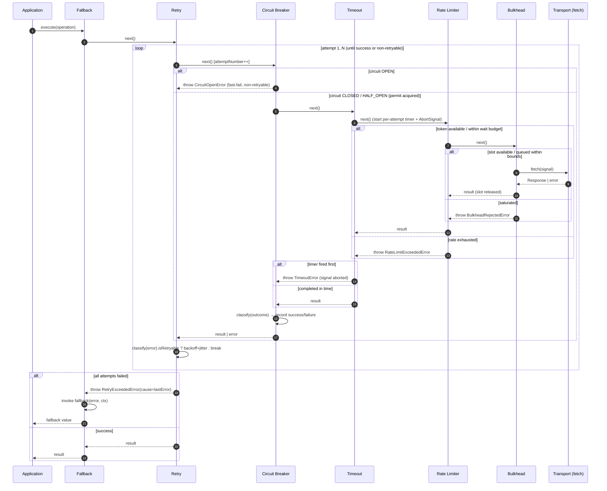
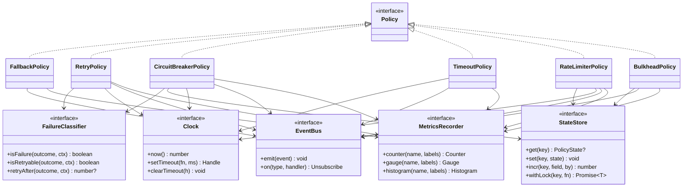
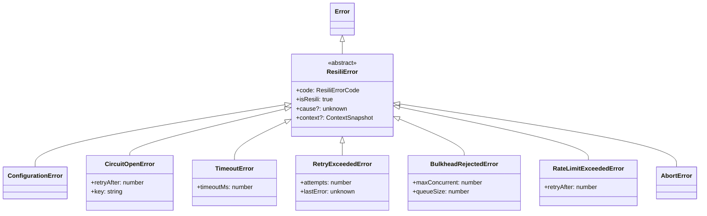
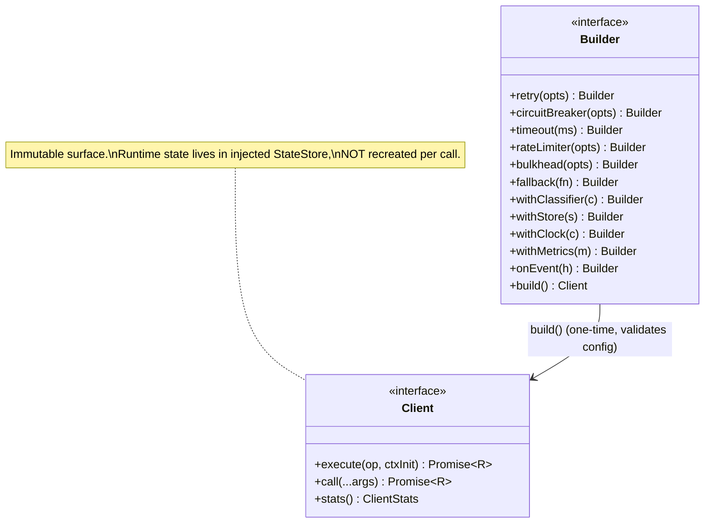
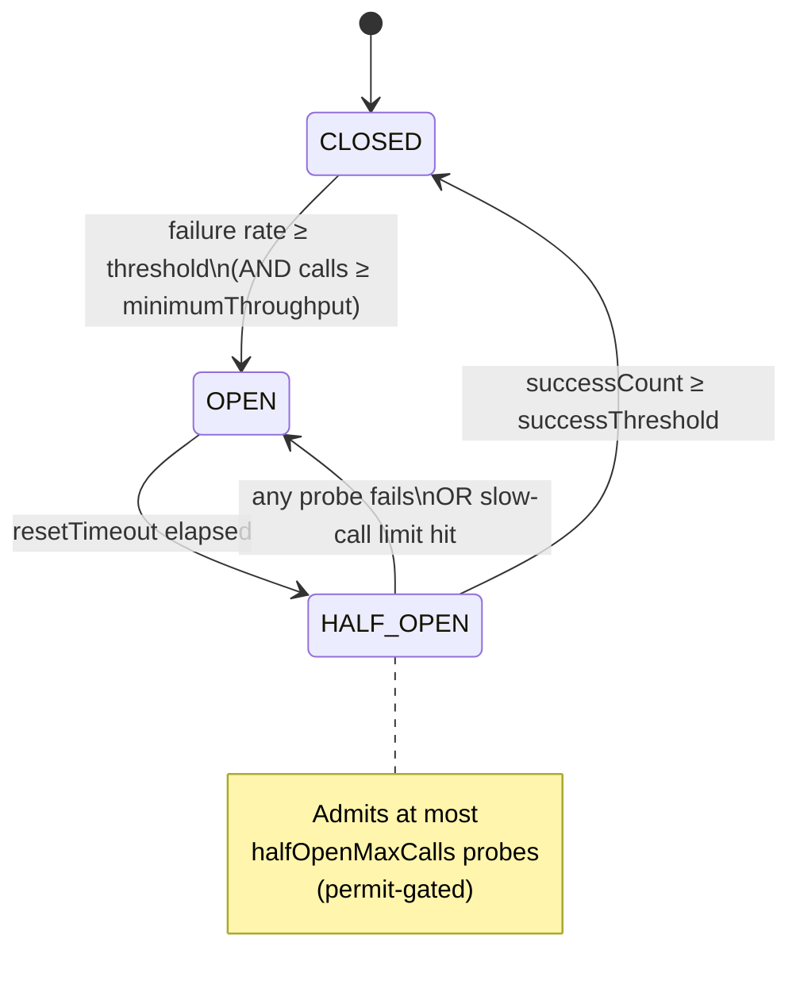
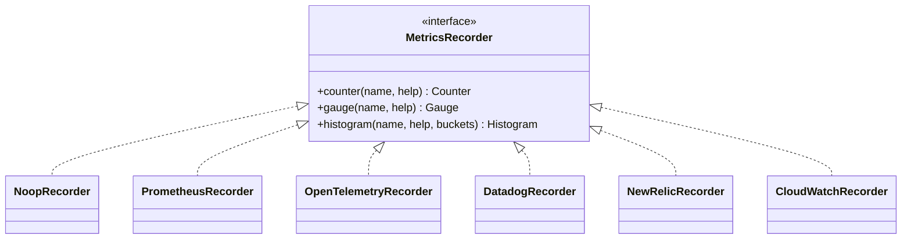
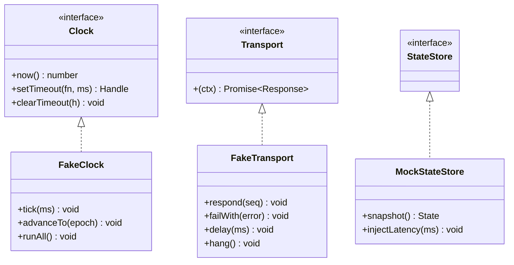

# Resili — Architecture Specification

> **Status:** Approved for implementation
> **Type:** Architecture Specification & Implementation Contract
> **Audience:** Maintainers and contributors
> **Authoritative:** This document supersedes the stub in `02-architecture.md`. No implementation may begin until a feature's section here is satisfied.

Resili is a production-ready, TypeScript-first resilience toolkit for modern Node.js (>=20), inspired by Resilience4j and Polly but designed around native primitives (`AbortController`, `AbortSignal`, `fetch`, ESM).

---

## Table of Contents

1. [Goals & Non-Goals](#1-goals--non-goals)
2. [Execution Pipeline & Composition Order](#2-execution-pipeline--composition-order)
3. [Public Architecture](#3-public-architecture)
4. [Error Hierarchy](#4-error-hierarchy)
5. [Context Object](#5-context-object)
6. [Failure Classification](#6-failure-classification)
7. [Builder Lifecycle & Client Lifetime](#7-builder-lifecycle--client-lifetime)
8. [Circuit Breaker Design](#8-circuit-breaker-design)
9. [Retry, Timeout, Bulkhead, Rate Limiter](#9-retry-timeout-bulkhead-rate-limiter)
10. [Event System](#10-event-system)
11. [Metrics Abstraction](#11-metrics-abstraction)
12. [State Ownership](#12-state-ownership)
13. [Testing Architecture](#13-testing-architecture)
14. [Architecture Decision Records](#14-architecture-decision-records)
15. [Folder Structure](#15-folder-structure)
16. [Documentation Index](#16-documentation-index)

> **Note on code blocks:** All TypeScript blocks in this document are **interface/type contracts** (declarations only, no method bodies). They define the implementation contract and contain no implementation logic.

---

## 1. Goals & Non-Goals

### Goals

| Goal | Description |
|------|-------------|
| Composable | Every policy is uniform middleware over a shared execution context. |
| Predictable | A single, documented, canonical composition order. |
| Observable | First-class typed events and a vendor-neutral metrics abstraction. |
| Testable | Injectable clock, virtual timers, fault-injectable transport. |
| Extensible | Pluggable state store, failure classifier, and custom policies. |
| Native | Built on `AbortSignal`/`AbortController`, ESM + CJS dual output. |
| Minimal deps | Zero required runtime dependencies in the core. |

### Non-Goals (v1)

| Non-Goal | Rationale |
|----------|-----------|
| Built-in distributed coordination | Core ships an in-memory store; distributed stores are adapters (see [§12](#12-state-ownership)). |
| Server-side request resilience semantics | Inbound (server) middleware is a distinct concern; v1 targets **outbound** calls. Retry/breaker are nonsensical on inbound requests. |
| Token-based (LLM) rate limiting | v1 rate limiter is request-based; token-cost limiting is a v3 extension. |
| Provider metric exporters | Core defines the metrics interface only; exporters ship as separate adapter packages. |

---

## 2. Execution Pipeline & Composition Order

### 2.1 Canonical Order

The pipeline is an **onion (decorator/middleware) model**. Each policy wraps the next and ultimately the transport. The **canonical order, outer → inner**, is:

```
Application
  → Fallback        (optional, outermost)
    → Retry
      → Circuit Breaker
        → Timeout
          → Rate Limiter
            → Bulkhead
              → Transport (fetch / user operation)
```

> **Deviation from the originally proposed order.** The initial proposal was `Retry → Timeout → Circuit Breaker → Bulkhead → Rate Limiter`. This spec makes **two deliberate corrections**, justified below:
> 1. **Circuit Breaker is placed *outside* Timeout** (was inside).
> 2. **Rate Limiter is placed *outside* Bulkhead** (was inside).

### 2.2 Sequence Diagram



### 2.3 Why This Order

| Boundary | Decision | Reason |
|----------|----------|--------|
| **Fallback outermost** | Wraps everything | Fallback must catch *any* terminal failure (`RetryExceededError`, `CircuitOpenError`, `TimeoutError`, etc.) and substitute a value. It is the last line of defense, so it is the first wrapper. |
| **Retry outside Circuit Breaker** | Retry re-drives the whole protected call | Each attempt gets a **fresh** breaker check, timeout window, rate token, and bulkhead slot. Retry consults the breaker every attempt and **fast-fails** on `CircuitOpenError` (treated as non-retryable), so we never spin retries against a known-open dependency. |
| **Circuit Breaker outside Timeout** ⚠️ *(corrected)* | Breaker wraps the timeout | The breaker must **observe timeouts as failures**. If Timeout were outside the breaker, a hung call would be aborted by the outer timer while the breaker is still awaiting the inner promise — leaving a dangling, unrecorded execution (a race). With CB outside, the Timeout policy deterministically rejects with `TimeoutError`, which the breaker counts and (optionally) treats as a slow-call failure. This matches Resilience4j (`CircuitBreaker` wraps `TimeLimiter`). |
| **Timeout outside admission (Rate Limiter & Bulkhead)** | Timeout wraps queue waits | The per-attempt deadline must include **time spent waiting** for a rate token or a bulkhead slot. A caller that asked for a 3s budget should not wait 5s in a bulkhead queue. Putting Timeout above admission makes the deadline honest. |
| **Rate Limiter outside Bulkhead** ⚠️ *(corrected)* | Rate check before concurrency slot | Rate limiting is **cheap admission control**; reject/throttle *before* occupying a scarce concurrency slot. If Bulkhead were outermost, a request would hold a concurrency slot while blocking on a rate token — wasting capacity and risking head-of-line stalls. |
| **Bulkhead innermost (closest to transport)** | Last gate before the call | The bulkhead's job is to bound **actual in-flight transport concurrency**, so it must sit directly in front of the transport with nothing else consuming slots. |

**General principle:** *fail fast and fail cheap.* Cheap, stateful rejections (circuit open → rate limited) happen before expensive resource acquisition (concurrency slot → network call).

---

## 3. Public Architecture

### 3.1 Core Model

Resili is built on three primitives:

- **`Operation<T>`** — the unit of work (innermost; e.g., a `fetch` call).
- **`Policy`** — uniform middleware: `execute(ctx, next)`.
- **`Pipeline`** — composes policies (in canonical order) into one executable.

```ts
/** The innermost unit of work, executed under a Context. */
type Operation<T> = (ctx: Context) => Promise<T>;

/** Uniform middleware. A policy wraps `next` and may short-circuit, retry, time-box, or observe it. */
interface Policy {
  readonly name: PolicyName;
  /** Position hint used by the Pipeline to enforce canonical ordering. */
  readonly order: number;
  execute<T>(ctx: Context, next: Operation<T>): Promise<T>;
}

type PolicyName =
  | 'fallback' | 'retry' | 'circuit-breaker'
  | 'timeout' | 'rate-limiter' | 'bulkhead' | string;

/** A composed, immutable chain of policies. */
interface Pipeline {
  readonly policies: ReadonlyArray<Policy>;
  execute<T>(operation: Operation<T>, ctx?: Partial<ContextInit>): Promise<T>;
}
```

### 3.2 Class Diagram — Core

```mermaid
classDiagram
    class Operation~T~ {
        <<type>>
        (ctx: Context) Promise~T~
    }

    class Policy {
        <<interface>>
        +name: PolicyName
        +order: number
        +execute(ctx, next) Promise~T~
    }

    class Pipeline {
        <<interface>>
        +policies: Policy[]
        +execute(operation, ctxInit) Promise~T~
    }

    class Builder {
        <<interface>>
        +fallback(fn) Builder
        +retry(opts) Builder
        +circuitBreaker(opts) Builder
        +timeout(ms) Builder
        +rateLimiter(opts) Builder
        +bulkhead(opts) Builder
        +withClassifier(c) Builder
        +withStore(s) Builder
        +withClock(c) Builder
        +withMetrics(m) Builder
        +onEvent(handler) Builder
        +build() Client~A,R~
    }

    class Client {
        <<interface>>
        +readonly config: ResolvedConfig
        +execute(operation, ctxInit) Promise~R~
        +call(...args) Promise~R~
        +stats() ClientStats
    }

    class Context {
        <<interface>>
        +requestId: string
        +operationName: string
        +serviceName: string
        +attemptNumber: number
        +metadata: ReadonlyMap
        +signal: AbortSignal
        +deadline: number
        +fork(patch) Context
    }

    Builder --> Pipeline : builds
    Builder --> Client : build()
    Client --> Pipeline : owns
    Pipeline --> Policy : composes
    Policy --> Operation~T~ : wraps next
    Policy --> Context : reads/forks
    Pipeline --> Context : creates root
```

### 3.3 Class Diagram — Policies & Dependencies



Every policy receives the same injected collaborators (`FailureClassifier`, `StateStore`, `Clock`, `MetricsRecorder`, `EventBus`) via the builder, enabling deterministic testing and pluggable backends.

---

## 4. Error Hierarchy

All Resili errors extend a single abstract base and carry a machine-readable `code`, the originating `cause` (ES2022), and a lightweight snapshot of the `Context`.

```ts
abstract class ResiliError extends Error {
  abstract readonly code: ResiliErrorCode;
  readonly isResili: true;
  readonly cause?: unknown;
  readonly context?: ContextSnapshot; // requestId, operationName, serviceName, attemptNumber
}

type ResiliErrorCode =
  | 'ERR_CONFIG' | 'ERR_CIRCUIT_OPEN' | 'ERR_TIMEOUT'
  | 'ERR_RETRY_EXCEEDED' | 'ERR_BULKHEAD_FULL'
  | 'ERR_RATE_LIMITED' | 'ERR_ABORTED';
```



| Error | Code | Thrown when | `cause` | Retryable? | Counts as breaker failure? |
|-------|------|-------------|---------|------------|----------------------------|
| `ConfigurationError` | `ERR_CONFIG` | At **`build()`** — invalid/contradictory options (e.g., `successThreshold` > window). Never thrown at runtime. | — | n/a | n/a |
| `CircuitOpenError` | `ERR_CIRCUIT_OPEN` | Breaker is `OPEN` (or `HALF_OPEN` with no permit) and short-circuits the call. Carries `retryAfter` until next half-open probe. | — | **No** (fast-fail) | **No** (don't double count) |
| `TimeoutError` | `ERR_TIMEOUT` | Per-attempt timeout elapses; the per-attempt `AbortSignal` is fired. | the abort reason | **Yes** | **Yes** (slow dependency) |
| `RetryExceededError` | `ERR_RETRY_EXCEEDED` | All retry attempts (or the retry budget) are exhausted. Wraps the last attempt's error. | last attempt error | terminal | terminal |
| `BulkheadRejectedError` | `ERR_BULKHEAD_FULL` | Max concurrency reached **and** queue full (or queue wait exceeded). | — | configurable (default **yes**) | **No** by default (local saturation, not a downstream fault) |
| `RateLimitExceededError` | `ERR_RATE_LIMITED` | No token available and wait budget exhausted (or `reject` mode). Carries `retryAfter`. | — | **Yes** (respect `retryAfter`) | **No** by default |
| `AbortError` | `ERR_ABORTED` | The **caller-supplied** `AbortSignal` fires, or the overall **deadline** is exceeded. | abort reason | **No** (terminal — caller intent) | **No** |

> **Key distinction:** `TimeoutError` (our timer) vs `AbortError` (external cancellation/deadline). They are separate classes precisely because failure classification treats them differently — timeouts are downstream faults that should trip the breaker; external aborts are caller intent and must not.

---

## 5. Context Object

A `Context` is created once per `Client.execute()` call (the **root context**) and **forked** per retry attempt (a **child context** with incremented `attemptNumber` and a fresh per-attempt signal linked to the parent).

```ts
interface Context {
  readonly requestId: string;        // correlation id, unique per logical call
  readonly operationName: string;    // e.g., "getUser"
  readonly serviceName: string;      // e.g., "user-service" — breaker/metric partition
  readonly attemptNumber: number;    // 1-based; incremented on each retry fork
  readonly metadata: ReadonlyMap<string, unknown>;
  readonly signal: AbortSignal;      // composed: caller signal ⊕ timeout ⊕ deadline
  readonly deadline: number;         // absolute epoch ms; overall budget across attempts
  readonly startedAt: number;        // epoch ms when root context was created
  /** Returns a derived child (e.g., next attempt) with a linked, fresh signal. */
  fork(patch: ContextForkPatch): Context;
}

interface ContextForkPatch {
  attemptNumber?: number;
  signal?: AbortSignal;     // per-attempt timeout signal, linked to parent
  metadata?: Record<string, unknown>;
}
```

| Field | Why it exists |
|-------|---------------|
| `requestId` | End-to-end correlation across logs, events, metrics, and traces. Generated if not supplied. |
| `operationName` | Human-readable label for events/metrics; low-cardinality dimension. |
| `serviceName` | The **partition key** for circuit breakers, bulkheads, and metrics. Two services should not share breaker state. |
| `attemptNumber` | Lets policies/events distinguish first call from retries; drives backoff and `RetryStarted` payloads. |
| `metadata` | Caller-defined context (tenant, route, idempotency key) for custom classifiers and event consumers. |
| `signal` | The **composed** abort signal: caller's signal **+** the per-attempt timeout **+** the overall deadline. The transport listens to exactly one signal. |
| `deadline` | Absolute overall budget. Even with retries/backoff, the call never exceeds the deadline; every policy checks it before acquiring resources. |
| `startedAt` | Basis for elapsed-time metrics and deadline math. |

> **Signal composition** is central: timeout and deadline are expressed as additional abort sources combined with the caller's signal (via `AbortSignal.any`-style linking). This guarantees cancellation propagates to the transport and that aborted attempts release bulkhead slots and tokens.

---

## 6. Failure Classification

Classification answers **two independent questions**, so it has two axes — conflating them is a common design bug:

1. **`isFailure`** — does this outcome count against the **circuit breaker** (and failure metrics)?
2. **`isRetryable`** — is this outcome eligible for a **retry**?

```ts
interface Outcome<T = unknown> {
  readonly status: 'success' | 'error';
  readonly value?: T;          // present on success (e.g., a Response)
  readonly error?: unknown;    // present on error
  readonly durationMs: number;
}

interface FailureClassifier {
  /** Counts toward circuit-breaker failure rate and failure metrics. */
  isFailure(outcome: Outcome, ctx: Context): boolean;
  /** Eligible for another retry attempt. */
  isRetryable(outcome: Outcome, ctx: Context): boolean;
  /** Optional hint (ms) from Retry-After / breaker, honored by Retry backoff. */
  retryAfter?(outcome: Outcome, ctx: Context): number | undefined;
}
```

### Default HTTP classification

| Outcome | `isFailure` (breaker) | `isRetryable` | Notes |
|---------|:---------------------:|:-------------:|-------|
| `2xx` / `3xx` | No | No | Success. |
| `400`, `404`, `422` (client errors) | **No** | **No** | Caller's fault, not a downstream fault — must **not** trip the breaker and retrying won't help. |
| `408 Request Timeout` | Yes | Yes | Server-side timeout. |
| `409` Conflict | No | No | Semantic; retry is unsafe by default. |
| `429 Too Many Requests` | **No** (configurable) | **Yes** | Backpressure, not a fault. Honor `Retry-After`. |
| `500`, `502`, `503`, `504` | **Yes** | **Yes** | Downstream faults. |
| Network errors (`ECONNRESET`, `ECONNREFUSED`, `ENOTFOUND`, `EPIPE`) | **Yes** | **Yes — idempotent only** | Retry only when the operation is marked idempotent (see below). |
| `TimeoutError` (ours) | **Yes** | **Yes** | Slow dependency. |
| `AbortError` (caller/deadline) | **No** | **No** | Caller intent; terminal. |
| `CircuitOpenError` | **No** | **No** | Already accounted for; fast-fail. |
| `BulkheadRejectedError` | No (default) | Yes (default) | Local saturation. |
| `RateLimitExceededError` | No (default) | Yes (honor `retryAfter`) | Local/remote flow control. |

### Answers to the required questions

- **404?** No — does not count, not retried.
- **429?** Does **not** count toward the breaker by default (it is flow control, configurable), but **is** retryable honoring `Retry-After`.
- **500?** Yes — counts and is retried.
- **AbortError?** No — external cancellation/deadline is caller intent; terminal, never counts.
- **TimeoutError?** Yes — counts (slow dependency) and is retryable.
- **Network failures?** Yes — count; retried **only for idempotent operations** to avoid duplicate side effects.
- **Custom predicates?** Yes — supply a custom `FailureClassifier`, or compose predicates via builder helpers. Idempotency is declared per operation (`metadata.idempotent` or builder option) and consumed by the default classifier.

---

## 7. Builder Lifecycle & Client Lifetime



| Question | Decision |
|----------|----------|
| **Can clients be reused?** | **Yes — clients are designed to be created once and reused** for the lifetime of the process. Reuse is required for the breaker/bulkhead/limiter to accumulate meaningful state. |
| **Should `build()` return immutable objects?** | **Yes.** `build()` validates config (throwing `ConfigurationError` on contradiction) and returns a frozen `Client` whose configuration cannot change. Mutable **runtime state** is held separately in the `StateStore`. |
| **Where should state live?** | In a pluggable **`StateStore`** owned by the client (default: in-memory, partitioned by `serviceName`/key). It is **never** recreated per request. For multi-instance/serverless, inject a shared store (see [§12](#12-state-ownership)). |
| **Should users create one client globally?** | **Yes — one client per logical downstream dependency, at module scope or via DI as a singleton.** Building a client inside a request/Lambda handler resets all state every call and silently disables the breaker. This footgun is documented prominently. |
| **Should breakers be shared per endpoint?** | Breakers are **partitioned by key** (default `serviceName`). Recommended model: **one client per downstream service**; if a single client fronts multiple endpoints, supply a `keyResolver` so each endpoint/host gets an isolated breaker (a flaky `/search` must not trip the breaker for `/health`). |

---

## 8. Circuit Breaker Design

### States



### Configuration (replaces the naive consecutive-count model)

| Option | Meaning |
|--------|---------|
| `window` | Sliding window: `{ type: 'count', size }` or `{ type: 'time', durationMs }`. |
| `failureRateThreshold` | Percentage (e.g., `50`) of failing calls in the window that opens the breaker. |
| `slowCallDurationMs` / `slowCallRateThreshold` | Calls slower than the duration count as "slow"; exceeding the slow-rate also opens the breaker. |
| `minimumThroughput` | Minimum calls in the window before the rate is evaluated (prevents tripping on 1/1 failures during low traffic). |
| `resetTimeout` | Time in `OPEN` before transitioning to `HALF_OPEN`. |
| `halfOpenMaxCalls` | Max concurrent probe calls allowed in `HALF_OPEN` (permit-gated; prevents flooding a recovering dependency). |
| `successThreshold` | Consecutive probe successes in `HALF_OPEN` required to close. |
| `key` / `keyResolver` | Partition key (default `serviceName`). |

> **Design fixes vs. the original stub:** sliding window + failure-rate (not naive consecutive count), `minimumThroughput` gate, slow-call detection, half-open permit limiting, and an `isFailure` classifier instead of treating every rejection equally. The overloaded `timeout` config field is removed (timeouts are the Timeout policy); only `resetTimeout` remains.

---

## 9. Retry, Timeout, Bulkhead, Rate Limiter

### Retry

| Concern | Decision |
|---------|----------|
| Backoff | `fixed`, `exponential`, with full/equal **jitter** (default: exponential + full jitter). |
| Budgets | `maxAttempts` **and** `maxTotalDelayMs` (retry budget) — backoff never exceeds the overall **deadline**. |
| Eligibility | Governed by `FailureClassifier.isRetryable`; `CircuitOpenError`/`AbortError` are terminal. |
| `Retry-After` | Honored via `classifier.retryAfter` (e.g., HTTP `429`/`503`). |
| Idempotency | Non-idempotent operations are **not** retried on network errors by default. Declared per operation. |
| Cancellation | Each attempt gets a **fresh per-attempt `AbortSignal`** via `ctx.fork()`; an aborted attempt does not leak the next. |

### Timeout

| Concern | Decision |
|---------|----------|
| Mechanism | `AbortController`; the per-attempt timeout is composed into `ctx.signal`. |
| Scope | **Per-attempt** (sits below Retry). The overall budget is the `deadline`. |
| Cleanup | Timer cleared on settle; signal composition releases listeners. |
| Limitation | Operations that ignore the signal cannot be truly cancelled — the wrapper rejects but the underlying work may continue. **Documented**; transports must honor the signal. |

### Bulkhead

| Concern | Decision |
|---------|----------|
| Limits | `maxConcurrent` (required) **and** `maxQueue` (required, default `0`). An **unbounded queue is forbidden**. |
| Strategy | `reject` or `queue`. Queue is **bounded** with `queueTimeoutMs`; overflow/timeout → `BulkheadRejectedError`. |
| Fairness | FIFO. |
| Budget | Queue wait counts against the per-attempt timeout/deadline (Timeout sits above Bulkhead). |

### Rate Limiter

| Concern | Decision |
|---------|----------|
| Strategy | `token-bucket` (burst-friendly) or `sliding-window` (smooth). |
| On limit | `reject` (→ `RateLimitExceededError`) or `wait` (block up to `maxWaitMs`, then reject). |
| Scope | In-memory per key by default; pluggable store for distributed limiting (see [§12](#12-state-ownership)). |
| Placement | Outside the bulkhead — never holds a concurrency slot while waiting for a token. |

---

## 10. Event System

A typed, synchronous-dispatch `EventBus`. Handlers are isolated: a throwing handler is caught, reported via metrics, and **never** breaks the pipeline.

```ts
interface ResiliEventBase {
  readonly type: ResiliEventType;
  readonly timestamp: number;     // epoch ms
  readonly requestId: string;
  readonly operationName: string;
  readonly serviceName: string;
}

type ResiliEventType =
  | 'RequestStarted' | 'RequestCompleted'
  | 'RetryStarted' | 'RetryCompleted' | 'RetryFailed'
  | 'CircuitOpened' | 'CircuitHalfOpened' | 'CircuitClosed'
  | 'TimeoutTriggered' | 'BulkheadRejected' | 'RateLimited';

interface EventBus {
  emit(event: ResiliEvent): void;
  on<T extends ResiliEventType>(type: T, handler: (e: EventByType<T>) => void): Unsubscribe;
  onAny(handler: (e: ResiliEvent) => void): Unsubscribe;
}
```

| Event | Emitted when | Payload (extends base) |
|-------|--------------|------------------------|
| `RequestStarted` | Root context created, before first attempt. | `deadline`, `metadata` |
| `RequestCompleted` | Pipeline settles (success or terminal error). | `durationMs`, `status`, `error?`, `attempts` |
| `RetryStarted` | Before a retry attempt (attempt ≥ 2). | `attemptNumber`, `delayMs`, `reason` (last error code) |
| `RetryCompleted` | Retried operation ultimately succeeds. | `attempts`, `totalDelayMs` |
| `RetryFailed` | Retry budget/attempts exhausted. | `attempts`, `lastError` |
| `CircuitOpened` | Breaker transitions `CLOSED/HALF_OPEN → OPEN`. | `key`, `failureRate`, `resetAt` |
| `CircuitHalfOpened` | Breaker transitions `OPEN → HALF_OPEN`. | `key`, `probesAllowed` |
| `CircuitClosed` | Breaker transitions `HALF_OPEN → CLOSED`. | `key` |
| `TimeoutTriggered` | Per-attempt timeout fires. | `attemptNumber`, `timeoutMs` |
| `BulkheadRejected` | Concurrency + queue saturated. | `maxConcurrent`, `queueSize`, `waitedMs` |
| `RateLimited` | Token unavailable (rejected or waited). | `strategy`, `retryAfterMs`, `waited` |

---

## 11. Metrics Abstraction

Vendor-neutral by design. Core depends only on a minimal recorder of three instrument types; exporters for Prometheus, OpenTelemetry, Datadog, New Relic, and CloudWatch are **separate adapter packages**.

```ts
type Labels = Readonly<Record<string, string>>;

interface Counter   { add(value: number, labels?: Labels): void; }
interface Gauge     { set(value: number, labels?: Labels): void; }
interface Histogram { record(value: number, labels?: Labels): void; }

interface MetricsRecorder {
  counter(name: string, help?: string): Counter;
  gauge(name: string, help?: string): Gauge;
  histogram(name: string, help?: string, buckets?: number[]): Histogram;
}
```



### Standard metrics (stable names)

| Metric | Type | Labels |
|--------|------|--------|
| `resili_requests_total` | counter | `service`, `operation`, `status` |
| `resili_request_duration_ms` | histogram | `service`, `operation` |
| `resili_retries_total` | counter | `service`, `operation` |
| `resili_circuit_state` | gauge | `service`, `key` (0=closed,1=half,2=open) |
| `resili_circuit_transitions_total` | counter | `service`, `key`, `to` |
| `resili_timeouts_total` | counter | `service`, `operation` |
| `resili_bulkhead_active` / `_queued` | gauge | `service`, `key` |
| `resili_bulkhead_rejected_total` | counter | `service`, `key` |
| `resili_rate_limited_total` | counter | `service`, `key` |

> **Cardinality rule:** labels are restricted to low-cardinality dimensions (`service`, `operation`, `key`, `status`). `requestId` is **never** a metric label (it belongs to events/traces).

---

## 12. State Ownership

| Concern | Decision |
|---------|----------|
| Default | **In-memory `StateStore`**, partitioned by key, owned by the client (zero dependencies). |
| Serverless / multi-instance | The in-memory store is **per-instance**; effective limits scale with instance count and breakers may not trip. This is **explicitly documented**. For shared semantics, inject a **distributed `StateStore`** adapter (e.g., Redis) — a separate package, preserving the zero-dep core. |
| Concurrency safety | `StateStore.withLock(key, fn)` provides atomic read-modify-write so breaker/limiter updates are race-free (and remain correct under a distributed backend). |
| Clock | All time reads go through the injected `Clock` so state transitions are deterministic in tests. |

```ts
interface StateStore {
  get<S extends PolicyState>(key: string): Promise<S | undefined> | S | undefined;
  set(key: string, state: PolicyState): Promise<void> | void;
  incr(key: string, field: string, by: number): Promise<number> | number;
  withLock<T>(key: string, fn: () => Promise<T> | T): Promise<T>;
}
```

---

## 13. Testing Architecture

Timing- and concurrency-sensitive code is the highest-risk area; tests must be **deterministic**, not wall-clock dependent. Line coverage is a floor (≥95%), **not** the quality bar.



| Capability | Mechanism |
|------------|-----------|
| **Fake clock / virtual timers** | `FakeClock` drives `now()` and timers; `tick(ms)` advances deterministically. Vitest `vi.useFakeTimers()` for the event loop. |
| **Fake transport** | `FakeTransport` scripts responses, errors, delays, and **never-resolving** ("hang") behavior. |
| **Mock state store** | `MockStateStore` exposes snapshots and can inject latency to simulate a slow/distributed backend. |
| **Deterministic retries** | Seeded jitter RNG + `FakeClock`; assert exact backoff schedule. |
| **Deterministic timeouts** | `FakeClock.tick(timeoutMs)` to fire timeouts without real waiting. |
| **Concurrency testing** | Launch N operations against `FakeTransport.hang()`; assert bulkhead `active`/`queued` invariants and slot release on abort. |
| **Race-condition testing** | `MockStateStore.withLock` contention tests; interleave breaker transitions via controlled clock ticks. |
| **Stress testing** | Benchmark harness at 100/500/1000/5000 ops measuring latency, memory, CPU, throughput. **Excluded from the CI gate** (run on-demand/nightly) due to noise. |
| **Chaos testing** | `FakeTransport` fault injection: random failures, delays, timeouts, connection resets — assert no leaked timers/slots/promises. |
| **Leak detection** | After each suite assert active handles, pending timers, and bulkhead occupancy are zero. |

---

## 14. Architecture Decision Records

Each ADR: **Decision · Alternatives · Pros · Cons · Reason · Status.**

### ADR-001 — Onion (middleware) pipeline
- **Decision:** Model every policy as uniform middleware `execute(ctx, next)` composed into a pipeline.
- **Alternatives:** Inheritance hierarchy of policies; hard-coded pipeline; event-driven chaining.
- **Pros:** Uniform contract; trivially extensible (custom policies); composition over inheritance; easy to test in isolation.
- **Cons:** One closure allocation per policy per call; ordering must be enforced centrally.
- **Reason:** Matches SOLID/composition goals and mirrors proven designs (Polly `PolicyWrap`, Koa middleware).
- **Status:** Accepted.

### ADR-002 — Canonical composition order
- **Decision:** `Fallback → Retry → Circuit Breaker → Timeout → Rate Limiter → Bulkhead → Transport` (fixed; not call-order).
- **Alternatives:** Honor builder call-order; user-defined order.
- **Pros:** Predictable semantics; prevents foot-guns; consistent metrics.
- **Cons:** Less flexible for exotic needs (mitigated by custom-policy insertion points).
- **Reason:** Correctness depends on order; users routinely get it wrong. See [§2.3](#23-why-this-order).
- **Status:** Accepted.

### ADR-003 — Circuit Breaker outside Timeout
- **Decision:** Breaker wraps Timeout so timeouts are recorded as failures.
- **Alternatives:** Timeout outside breaker (original proposal).
- **Pros:** Deterministic failure accounting; enables slow-call detection; no dangling executions.
- **Cons:** Reverses the initial proposal; reviewers must re-learn.
- **Reason:** Avoids the race where an outer timeout abandons an in-flight call the breaker never records. Matches Resilience4j.
- **Status:** Accepted (supersedes original order).

### ADR-004 — Rate Limiter outside Bulkhead
- **Decision:** Check rate before acquiring a concurrency slot.
- **Alternatives:** Bulkhead outside rate limiter (original proposal).
- **Pros:** Fail cheap before scarce resources; no slot held while awaiting a token.
- **Cons:** Reverses initial proposal.
- **Reason:** "Fail fast and cheap"; prevents slot starvation under throttling.
- **Status:** Accepted (supersedes original order).

### ADR-005 — Two-axis failure classification
- **Decision:** Separate `isFailure` (breaker) from `isRetryable` (retry), plus optional `retryAfter`.
- **Alternatives:** Single boolean predicate.
- **Pros:** Correctly models cases like `429` (retryable, not a breaker fault) and `404` (neither).
- **Cons:** Slightly larger interface.
- **Reason:** Conflating the two is a known correctness bug.
- **Status:** Accepted.

### ADR-006 — Pluggable StateStore (state ownership)
- **Decision:** In-memory default; distributed adapters injected via `StateStore`.
- **Alternatives:** Always in-memory; mandatory external store; built-in Redis.
- **Pros:** Zero-dep core; serverless/multi-instance supported via adapters; testable via mock.
- **Cons:** Distributed correctness is the adapter's responsibility; default is per-instance.
- **Reason:** Reconciles "zero deps" with serverless targets without forcing a dependency.
- **Status:** Accepted.

### ADR-007 — Immutable, reusable Client
- **Decision:** `build()` validates and returns a frozen client; runtime state lives in the store.
- **Alternatives:** Mutable client; per-call construction.
- **Pros:** Safe sharing; prevents the "rebuild per request resets the breaker" footgun.
- **Cons:** Reconfiguration requires a rebuild.
- **Reason:** Stateful policies require a long-lived instance.
- **Status:** Accepted.

### ADR-008 — Sliding-window circuit breaker
- **Decision:** Failure-rate + slow-call over a sliding window, `minimumThroughput` gate, half-open permits.
- **Alternatives:** Consecutive-failure count (original stub).
- **Pros:** Production-grade; resistant to low-traffic false trips; controls recovery load.
- **Cons:** More configuration surface.
- **Reason:** Consecutive-count breakers are toys; this matches Resilience4j/Hystrix.
- **Status:** Accepted.

### ADR-009 — Vendor-neutral metrics
- **Decision:** Minimal counter/gauge/histogram recorder; exporters are adapters.
- **Alternatives:** Bind to Prometheus; bind to OpenTelemetry.
- **Pros:** No lock-in; supports all listed backends; stable metric names defined now.
- **Cons:** Users must wire an adapter.
- **Reason:** Future-proofs v2 metrics ahead of v3 OTel/Prometheus work; avoids a breaking change.
- **Status:** Accepted.

### ADR-010 — Injectable Clock & deterministic tests
- **Decision:** All time/timers go through an injected `Clock`; tests use `FakeClock` + virtual timers.
- **Alternatives:** Direct `Date.now()`/`setTimeout`.
- **Pros:** Deterministic, fast, non-flaky timing tests.
- **Cons:** Indirection in hot paths (negligible).
- **Reason:** Timing code is the riskiest; coverage % alone can't protect it.
- **Status:** Accepted.

### ADR-011 — Typed error hierarchy with `cause`
- **Decision:** Single `ResiliError` base; specific subclasses; ES2022 `cause`.
- **Alternatives:** Plain `Error` + string codes; per-policy ad-hoc errors.
- **Pros:** Callers and fallbacks can branch precisely; preserves root cause.
- **Cons:** More classes to maintain.
- **Reason:** Distinguishing `CircuitOpenError` from real downstream errors is essential for DX and fallback logic.
- **Status:** Accepted.

### ADR-012 — Context with AbortSignal + deadline
- **Decision:** Per-call context carrying a composed signal and absolute deadline; forked per attempt.
- **Alternatives:** Pass options positionally; per-policy timers without a shared budget.
- **Pros:** Honest budgets across retries/queues; cancellation reaches the transport; releases resources.
- **Cons:** Context threading discipline required.
- **Reason:** Native, correct cancellation and end-to-end deadlines.
- **Status:** Accepted.

### ADR-013 — Per-attempt timeout + overall deadline
- **Decision:** Timeout policy bounds each attempt; deadline bounds the whole call.
- **Alternatives:** Single overall timeout only; per-attempt only.
- **Pros:** Bounds individual hangs and total latency simultaneously.
- **Cons:** Two related but distinct knobs to document.
- **Reason:** HTTP needs per-attempt bounds; callers need a total budget.
- **Status:** Accepted.

### ADR-014 — Outbound-only scope for v1
- **Decision:** v1 targets outbound calls; inbound (server) middleware deferred.
- **Alternatives:** Unify inbound/outbound in one middleware.
- **Pros:** Avoids conflating nonsensical semantics (retrying inbound requests).
- **Cons:** Express/inbound users wait for a later release.
- **Reason:** Retry/breaker are client-side concerns; inbound needs a different model.
- **Status:** Accepted.

---

## 15. Folder Structure

```
resili/
├── src/
│   ├── core/
│   │   ├── pipeline.ts          # Pipeline composition + canonical ordering
│   │   ├── context.ts           # Context + fork + signal composition
│   │   ├── builder.ts           # Fluent Builder → Client
│   │   ├── client.ts            # Immutable Client
│   │   └── policy.ts            # Policy contract
│   ├── policies/
│   │   ├── fallback/
│   │   ├── retry/
│   │   ├── circuit-breaker/     # state machine + sliding window
│   │   ├── timeout/
│   │   ├── rate-limiter/        # token-bucket + sliding-window
│   │   └── bulkhead/
│   ├── classification/
│   │   ├── classifier.ts        # FailureClassifier contract
│   │   └── http-defaults.ts     # default HTTP matrix
│   ├── state/
│   │   ├── store.ts             # StateStore contract
│   │   └── memory-store.ts      # in-memory default
│   ├── time/
│   │   ├── clock.ts             # Clock contract
│   │   └── system-clock.ts
│   ├── events/
│   │   ├── bus.ts               # EventBus
│   │   └── events.ts            # event types + payloads
│   ├── metrics/
│   │   ├── recorder.ts          # MetricsRecorder contract
│   │   ├── noop.ts
│   │   └── names.ts             # standard metric names/labels
│   ├── errors/
│   │   └── errors.ts            # ResiliError hierarchy
│   ├── adapters/
│   │   ├── fetch/               # fetch wrapper (v1)
│   │   └── axios/               # (later)
│   ├── types/
│   │   └── public.ts            # exported public types
│   └── index.ts                 # public entrypoint (tree-shakable)
├── tests/
│   ├── unit/
│   ├── integration/             # local express + fake HTTP server
│   ├── concurrency/
│   ├── chaos/
│   └── helpers/                 # FakeClock, FakeTransport, MockStateStore
├── benchmarks/                  # stress/throughput (not in CI gate)
├── examples/
│   ├── fetch-basic/
│   ├── express-outbound/
│   └── lambda/
├── docs/                        # see §16
├── .github/workflows/           # lint · test · build · pack-verify · publish
├── package.json                 # exports map (ESM+CJS), sideEffects:false
├── tsconfig.json
├── tsup.config.ts               # dual ESM/CJS build
├── vitest.config.ts
├── README.md
└── CHANGELOG.md
```

---

## 16. Documentation Index

| Doc | Title | Purpose | Status |
|-----|-------|---------|--------|
| `ARCHITECTURE.md` | Architecture Specification | This document — the implementation contract. | Authoritative |
| `01-project-overview.md` | Project Overview | Vision, goals, scope. | Existing |
| `02-architecture.md` | Architecture (legacy stub) | Superseded by `ARCHITECTURE.md`. | Deprecated |
| `03-circuit-breaker.md` | Circuit Breaker | Detailed CB config & state machine. | To update per [§8](#8-circuit-breaker-design) |
| `04-retry.md` | Retry | Backoff, jitter, budgets, idempotency. | To update per [§9](#9-retry-timeout-bulkhead-rate-limiter) |
| `05-timeout.md` | Timeout | Per-attempt vs deadline, signal model. | To update |
| `06-bulkhead.md` | Bulkhead | Bounded queue & reject semantics. | To update |
| `07-rate-limiter.md` | Rate Limiter | Token-bucket / sliding-window. | To update |
| `08-fetch-adapter.md` | Fetch Adapter | Response→outcome mapping. | To update |
| `09-testing.md` | Testing | Determinism, fakes, chaos, gates. | To update per [§13](#13-testing-architecture) |
| `10-release.md` | Release & Publish | Build, pack-verify, CI/CD. | Existing |
| `roadmap.md` | Roadmap | Version scope (reconcile with feature list). | To update |
| `CURSOR_RULES.md` | Contributor Rules | Workflow & coding standards. | Existing |
| *new* `11-failure-classification.md` | Failure Classification | The default matrix & custom classifiers. | Planned |
| *new* `12-state-store.md` | State Store | In-memory & distributed adapters. | Planned |
| *new* `13-events.md` | Events | Event catalog & payloads. | Planned |
| *new* `14-metrics.md` | Metrics | Recorder interface & exporters. | Planned |
| *new* `15-error-handling.md` | Errors | Hierarchy & handling patterns. | Planned |
| *new* `adr/` | ADR Records | One file per ADR (mirrors [§14](#14-architecture-decision-records)). | Planned |

---

**End of specification.** Implementation may proceed feature-by-feature in roadmap order, each satisfying its section above, following the workflow in `CURSOR_RULES.md` (implement → lint → test → fix → approval).
