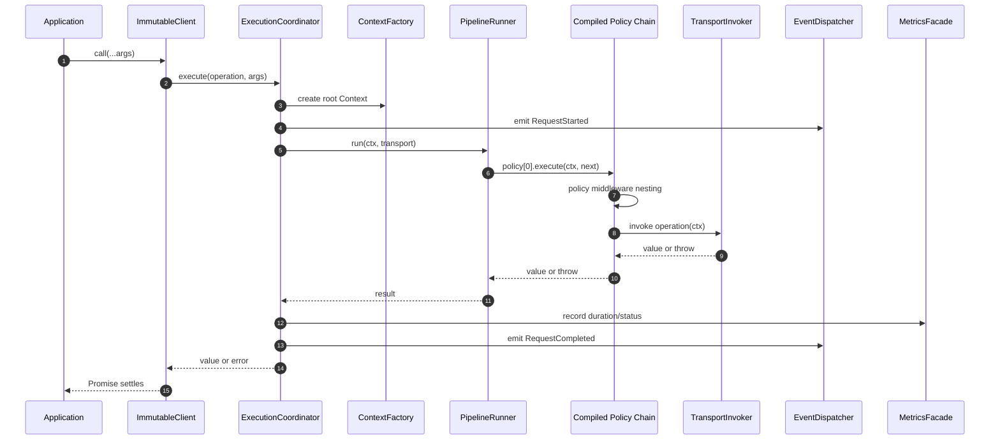
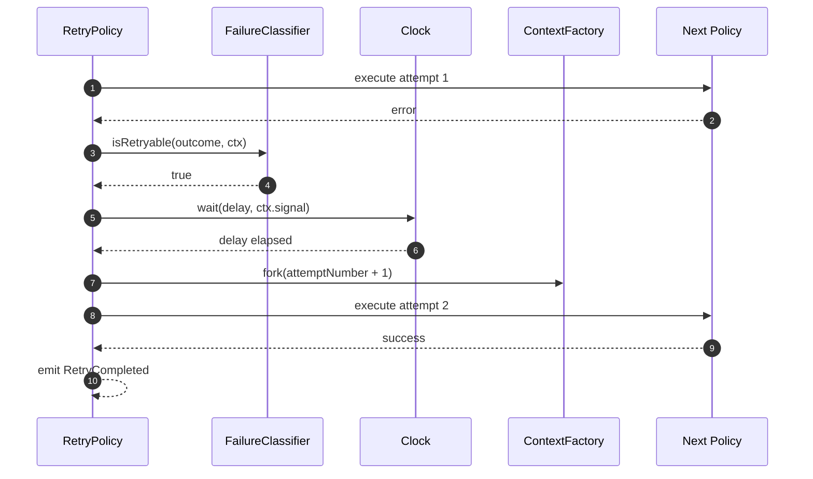
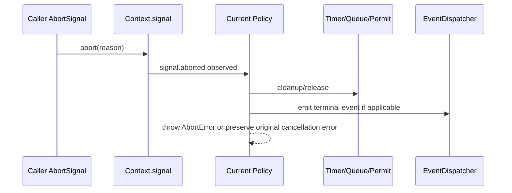
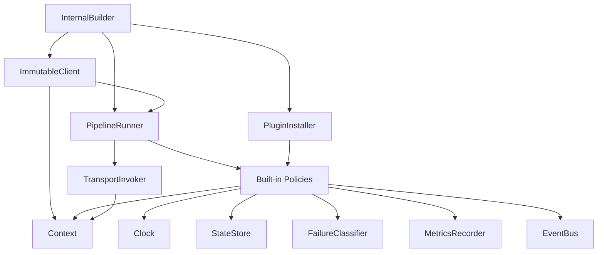

# Resili Internal Design Handbook

> **Status:** Internal implementation guide
> **Audience:** Resili maintainers and contributors
> **Public API Impact:** None. This document does **not** define public API.
> **Authority:** Must preserve `ARCHITECTURE.md` and `API_SPECIFICATION.md`.

This document describes how Resili should be implemented internally while keeping the frozen public API unchanged. Classes, services, executors, compilers, and helpers named here are internal implementation details unless they are explicitly exported by `API_SPECIFICATION.md`.

No user should import anything from internal paths. The package export map must continue to expose only the public surface.

---

## 1. Design Principles

| Principle | Internal Rule |
|---|---|
| Single responsibility | Each service owns one reason to change: timing, classification, event dispatch, state mutation, etc. |
| Composition over inheritance | Concrete policies compose executors/helpers; avoid deep class hierarchies. |
| Public API preservation | Internal class names may change in minor/patch releases; public contracts may not. |
| Determinism | Pipeline order, event order, and state transitions must be deterministic and testable. |
| Hot-path discipline | Avoid avoidable allocations in per-request and per-attempt code. |
| Dependency inversion | Policies depend on internal service interfaces and public extension contracts, not concrete globals. |
| Cancellation-first | Every async path must respect `Context.signal` and release resources on abort. |

---

## 2. Internal Package Layout

```text
src/
  index.ts
  core/
    context/
    errors/
    clock/
    classification/
    state/
    events/
    metrics/
    policy/
    pipeline/
    builder/
    client/
    plugins/
    transport/
    internal/
      config/
      ordering/
      signals/
      timers/
      validation/
      collections/
      diagnostics/
  policies/
    fallback/
    retry/
    circuit-breaker/
    timeout/
    rate-limiter/
    bulkhead/
    cache/
  adapters/
    fetch/
  testing/
    fakes/
    fixtures/
```

| Folder | Responsibility | Exported? |
|---|---|---|
| `core/context/` | Public `Context` contracts plus internal creation/fork helpers. | Public types only as specified. |
| `core/errors/` | Public error classes and internal normalization helpers. | Public error classes only. |
| `core/clock/` | Public `Clock` contract and `systemClock`; fake clocks live in tests. | `Clock`, `systemClock`. |
| `core/classification/` | Public `FailureClassifier`, `Outcome`, `httpClassifier`, composition helpers. | As API spec. |
| `core/state/` | Public `StateStore`, `PolicyState`, `memoryStore`; internal lock implementation. | As API spec. |
| `core/events/` | Typed event bus implementation behind public event types. | Event types only. |
| `core/metrics/` | Vendor-neutral metrics recorder abstraction and noop recorder. | As API spec. |
| `core/policy/` | Public custom policy contracts and internal policy adapters. | `Policy`, `PolicyFactory`, `definePolicy`. |
| `core/pipeline/` | Internal middleware compiler and executor. | Internal only. |
| `core/builder/` | Internal builder implementation returned by `resili()`. | Public `Builder` type only. |
| `core/client/` | Immutable client implementation. | Public `Client` type only. |
| `core/plugins/` | Plugin setup, dependency sorting, compatibility validation. | Public plugin types/helpers only. |
| `core/transport/` | Invokes wrapped operations and adapters. | Internal. |
| `core/internal/` | Shared internal utilities with no public contract. | Never. |
| `policies/*/` | Concrete policy implementations. | Concrete classes remain internal. |
| `adapters/fetch/` | Native fetch adapter internals. | Public adapter only when API spec adds it. |
| `testing/` | Internal test utilities; not packaged. | Never. |

---

## 3. Internal Services

| Service | Responsibility | Shared? | Hot Path? |
|---|---|---:|---:|
| `ExecutionCoordinator` | Owns client-level execution: create root context, enter pipeline, finalize request events/metrics. | Per client | Yes |
| `PipelineCompiler` | Converts ordered policies into an executable middleware chain. | Per build | No |
| `PipelineRunner` | Executes the compiled chain for one request. | Per client | Yes |
| `PolicyResolver` | Validates policy order anchors and produces canonical order. | Per build | No |
| `PolicyServicesFactory` | Creates the dependency bag passed to `PolicyFactory.create`. | Per build | No |
| `ConfigurationNormalizer` | Converts shorthands to normalized config objects. | Per build | No |
| `BuilderValidator` | Validates options, plugins, duplicate policies, and incompatible settings. | Per build | No |
| `ContextFactory` | Creates root contexts and forks attempt contexts through public `Context` contract. | Per request | Yes |
| `SignalComposer` | Composes caller, timeout, and deadline signals. | Per attempt | Yes |
| `TransportInvoker` | Calls the wrapped operation with the current context and maps thrown values to outcomes. | Per execution | Yes |
| `FailureAnalyzer` | Thin internal adapter over public `FailureClassifier`. No independent classification logic. | Per outcome | Yes |
| `DelayCalculator` | Computes retry delays from normalized `RetryOptions` and classifier hints. | Per retry | Yes |
| `TimeoutScheduler` | Owns per-attempt timer creation/cleanup through `Clock`. | Per timed attempt | Yes |
| `CircuitStateMachine` | Evaluates closed/open/half-open transitions. | Per breaker key | Yes |
| `SlidingWindow` | Stores rolling counts/latency buckets for circuit breaker. | Per breaker key | Yes |
| `BulkheadSemaphore` | Owns active permit count, bounded FIFO queue, and queue timeout cleanup. | Per key | Yes |
| `RateLimitBucket` | Implements token bucket or sliding-window admission. | Per key | Yes |
| `EventDispatcher` | Synchronous typed event dispatch with listener isolation. | Per client | Yes |
| `MetricsFacade` | Low-cardinality helper over public `MetricsRecorder`. | Per client | Yes |
| `StateLockManager` | Provides in-memory `withLock` sequencing for `memoryStore`. | Per store | Yes |
| `PluginInstaller` | Sorts plugins, checks `apiVersion`, runs setup, stores disposers. | Per build | No |
| `ResourceDisposer` | Runs client/plugin/policy cleanup idempotently. | Per client | No |

### Shared Service Rules

- `Clock`, `StateStore`, `MetricsRecorder`, `FailureClassifier`, and `EventDispatcher` are client-scoped shared services.
- Policy internals may hold per-key state handles, but durable mutable state must live in `StateStore`.
- No service may import concrete policies except `PolicyResolver`/builder wiring.
- No policy may instantiate another policy.

---

## 4. Policy Internal Design

All built-in policies implement the public middleware shape internally:

```text
execute(ctx, next) -> Promise<T>
```

Concrete policy classes are internal. Public users configure behavior through builder options only.

### 4.1 Retry

| Internal Class | Responsibility |
|---|---|
| `RetryPolicy` | Middleware wrapper; controls retry loop and context forking. |
| `RetryExecutor` | Non-recursive attempt loop. |
| `DelayCalculator` | Fixed/exponential delay, jitter, caps, retry-after hints. |
| `RetryBudgetTracker` | Tracks max attempts, total delay, and deadline remaining. |
| `RetryEventEmitter` | Emits `RetryStarted`, `RetryCompleted`, `RetryFailed`. |

Execution flow:

1. Execute first attempt with incoming context.
2. Convert result/error into `Outcome`.
3. Ask `FailureClassifier.isRetryable`.
4. If retryable and budget remains, compute delay.
5. Wait through `Clock`/abort-aware timer.
6. Fork context with incremented `attemptNumber`.
7. Repeat without recursion.
8. Throw `RetryExceededError` on terminal exhaustion.

Dependencies: `Clock`, `FailureClassifier`, `EventDispatcher`, `MetricsFacade`, `ContextFactory`.

State ownership: Retry keeps per-call counters locally; no persistent `StateStore` state in v1.

### 4.2 Timeout

| Internal Class | Responsibility |
|---|---|
| `TimeoutPolicy` | Wraps `next` with per-attempt timeout signal. |
| `TimeoutScheduler` | Starts and clears per-attempt timers. |
| `TimeoutSignalController` | Composes timeout abort with parent context signal. |

Execution flow:

1. Start per-attempt timer before `next`.
2. Fork or derive context with composed signal.
3. Race downstream completion against timer.
4. On timer, abort signal and throw `TimeoutError`.
5. Always clear timer and listeners in `finally`.

Dependencies: `Clock`, `SignalComposer`, `EventDispatcher`, `MetricsFacade`.

State ownership: none.

### 4.3 Circuit Breaker

| Internal Class | Responsibility |
|---|---|
| `CircuitBreakerPolicy` | Middleware gate and outcome recorder. |
| `CircuitStateMachine` | Owns transition rules. |
| `SlidingWindow` | Maintains count/time buckets. |
| `HalfOpenPermitPool` | Limits concurrent probes. |
| `CircuitKeyResolver` | Resolves partition key from config/context. |

Execution flow:

1. Resolve key.
2. Load state via `StateStore.withLock`.
3. Reject immediately with `CircuitOpenError` if open and not ready.
4. Acquire half-open permit when applicable.
5. Execute downstream.
6. Classify outcome through `FailureClassifier.isFailure`.
7. Update sliding window and transition state under lock.
8. Release half-open permit in `finally`.

Dependencies: `StateStore`, `Clock`, `FailureClassifier`, `EventDispatcher`, `MetricsFacade`.

State ownership: breaker state lives in `StateStore`, partitioned by key.

### 4.4 Bulkhead

| Internal Class | Responsibility |
|---|---|
| `BulkheadPolicy` | Middleware admission control. |
| `BulkheadSemaphore` | Tracks active permits. |
| `BulkheadQueue` | Bounded FIFO wait queue. |
| `BulkheadKeyResolver` | Resolves partition key. |

Execution flow:

1. Resolve key.
2. Try acquire permit.
3. If full and queue disabled/full, throw `BulkheadRejectedError`.
4. If queued, wait until permit or queue timeout/cancellation.
5. Execute downstream.
6. Release permit and wake next waiter in `finally`.

Dependencies: `Clock`, `StateStore` if distributed backend is used, `EventDispatcher`, `MetricsFacade`.

State ownership: in-memory semaphore for default client-local behavior; distributed adapters may map permits to `StateStore`.

### 4.5 Rate Limiter

| Internal Class | Responsibility |
|---|---|
| `RateLimiterPolicy` | Middleware admission control before bulkhead. |
| `TokenBucket` | Token-bucket accounting. |
| `SlidingRateWindow` | Sliding-window accounting. |
| `RateLimitWaiter` | Handles bounded wait mode. |
| `RateLimitKeyResolver` | Resolves partition key. |

Execution flow:

1. Resolve key.
2. Refill/evaluate under `StateStore.withLock`.
3. If accepted, execute downstream.
4. If limited and `reject`, throw `RateLimitExceededError`.
5. If limited and `wait`, sleep until token or `maxWaitMs`/deadline/cancel.

Dependencies: `Clock`, `StateStore`, `EventDispatcher`, `MetricsFacade`.

State ownership: limiter counters/tokens live in `StateStore`.

### 4.6 Fallback

| Internal Class | Responsibility |
|---|---|
| `FallbackPolicy` | Outermost terminal error handler. |
| `FallbackSelector` | Checks `fallbackOn` predicate. |
| `FallbackInvoker` | Calls fallback handler with error and context. |

Execution flow:

1. Execute downstream.
2. Return success unchanged.
3. On error, evaluate fallback predicate.
4. If allowed, invoke fallback handler.
5. If denied or fallback fails, propagate error preserving cause.

Dependencies: `EventDispatcher`, `MetricsFacade`.

State ownership: none.

### 4.7 Cache

Cache is a future policy from the roadmap. It must be added as a normal policy through `PolicyFactory` and canonical ordering rules, not as a special pipeline path.

| Internal Class | Responsibility |
|---|---|
| `CachePolicy` | Internal future middleware. |
| `CacheKeyResolver` | Resolves cache key. |
| `CacheStoreAdapter` | Bridges to a cache backend; not `StateStore`. |

State ownership: cache data must not be stored in `StateStore`; `StateStore` is for operational policy state only.

---

## 5. Execution Flow

### 5.1 Request Through Compiled Pipeline



### 5.2 Retry Attempt Flow



### 5.3 Cancellation Flow



---

## 6. Dependency Graph



### Dependency Rules

| Component | May Depend On | Must Not Depend On |
|---|---|---|
| `Context` | none or signal utilities | policies, builder, client |
| `Errors` | `ContextSnapshot` type | policies, pipeline |
| `Events` | event types, metrics error counter | policies directly |
| `Metrics` | no core runtime dependencies | events, policies |
| `StateStore` | lock utilities | policies |
| `Policies` | public services, internal helpers | builder, client, concrete sibling policies |
| `Pipeline` | policy contract, context | concrete policy internals |
| `Builder` | config, plugins, policy factories, pipeline compiler | runtime execution state |
| `Client` | pipeline, coordinator, disposers | builder mutation internals |

No circular dependencies are allowed. If two modules need shared behavior, move it to `core/internal/*`.

---

## 7. Object Lifecycle and Ownership

| Object | Created By | Lifetime | Owns | Disposal |
|---|---|---|---|---|
| Builder | `resili()` / `createClient()` factory | Build phase | mutable config snapshot | none |
| Client | Builder `build()` | Process/singleton | pipeline, services, plugin instances | `client.destroy()` |
| Pipeline | Builder/PipelineCompiler | Client lifetime | compiled policy chain | disposed through client |
| Policies | Policy factories during build | Client lifetime | policy-local config/helpers | optional internal disposer |
| StateStore | User or default factory | Client or external lifetime | runtime policy state | if owned by client, dispose on destroy |
| EventBus | Builder default | Client lifetime | listener sets | clear on destroy |
| Metrics | User or noop default | External or client lifetime | recorder handles | do not dispose user-owned recorders |
| Context | ExecutionCoordinator | Single logical request/attempt | immutable metadata and signal | GC after request |
| TransportInvoker | Client | Client lifetime | wrapped operation reference | none |
| PluginInstance | Plugin setup | Client lifetime | plugin resources | `dispose()` on destroy |

### Ownership Rules

- User-supplied services are not disposed unless the public contract explicitly says Resili owns them.
- Client-created defaults are owned by the client.
- Per-request resources must be released in `finally` blocks.
- `destroy()` is idempotent.

---

## 8. Concurrency Model

JavaScript runs user code on one event loop, but async operations interleave. Resili must treat all shared mutable state as concurrently accessed.

| Concern | Internal Rule |
|---|---|
| Parallel requests | May share policy instances and services; mutable state must be protected by `StateStore.withLock` or policy-local queues. |
| Nested execution | Event listeners or fallback handlers may trigger new clients; no global mutable execution state. |
| Cancellation | Every timer, queue waiter, and permit holder observes `ctx.signal`. |
| Resource cleanup | Timer handles, event listeners, bulkhead permits, and half-open permits are released in `finally`. |
| State transitions | Circuit and limiter mutations happen under keyed locks. |
| Timer ownership | The policy that creates a timer owns clearing it. |
| Event ordering | Dispatch is synchronous and FIFO for one publish call; nested publishes complete depth-first. |
| Thread safety | Worker threads must use separate clients unless a distributed `StateStore` is configured. |

---

## 9. Memory Management

| Area | Strategy |
|---|---|
| Context | Shallow-copy metadata only on creation/fork; do not deep clone metadata values. |
| Pipeline | Compile middleware chain once per client; no per-call sorting. |
| Retry | Use iterative loops, not recursion. Allocate one attempt context per retry attempt. |
| Events | Do not clone payloads on dispatch; event payloads are treated as immutable. |
| Metrics | Cache metric handles by name/label set where practical. |
| StateStore | Use lazy expiration/cleanup; no background polling in core. |
| Sliding windows | Use fixed-size ring buffers for count windows; compact buckets for time windows. |
| Bulkhead queue | Bounded FIFO arrays/ring queues; never unbounded. |
| Plugins | Store plugin instances in maps keyed by name; clear on destroy. |

Pooling is not required initially. Introduce pooling only after benchmarks show GC pressure on a hot path and tests prove no cross-request leakage.

Weak references are generally unnecessary. Prefer explicit `destroy()`/unsubscribe cleanup.

---

## 10. Performance Design

### Hot Paths

| Hot Path | Complexity Target | Notes |
|---|---:|---|
| Pipeline execution | O(policies) | Chain compiled once; execution traverses fixed policy array. |
| Event dispatch | O(listeners for type + any) | Listener lookup by event type map. |
| State get/set | O(1) expected | Backed by `Map` for memory store. |
| Circuit window update | O(1) | Ring buffer or bucket accumulator. |
| Rate token check | O(1) | Compute refill from last timestamp. |
| Bulkhead acquire/release | O(1) | Queue wake-up amortized O(1). |
| Retry delay calculation | O(1) | No allocation-heavy strategy objects per attempt. |

### Cold Paths

- Builder validation.
- Plugin dependency sorting.
- Policy order resolution.
- Pipeline compilation.
- API extractor/public report generation.

Cold paths should favor clarity and diagnostics over micro-optimizations.

### Expected Throughput

Initial internal benchmark targets on Node 20+:

| Scenario | Target |
|---|---:|
| Empty pipeline overhead | < 5 microseconds per call excluding transport |
| One no-op policy | < 8 microseconds per call excluding transport |
| Event dispatch with no listeners | < 1 microsecond |
| Memory store get/set | O(1), no promise allocation for sync store |
| Retry immediate success | one downstream call, no timer allocation |

Targets are guidelines, not public guarantees.

---

## 11. Internal Extension Points

These are internal implementation seams, not public APIs.

| Internal Extension | Purpose | Public Contract It Supports |
|---|---|---|
| `PolicyFactoryAdapter` | Converts public `PolicyFactory` to internal policy instance. | `definePolicy`, `builder.policy` |
| `PluginSetupContext` | Internal implementation of public `PluginContext`. | `builder.use` |
| `PolicyOrderResolver` | Converts numeric/relative order anchors to canonical order. | `POLICY_ORDER`, `PolicyOrder` |
| `ServiceRegistry` | Stores client-scoped service instances. | builder `with*` methods |
| `TransportAdapter` | Wraps fetch/user operation into context-aware invocation. | `resili(operation)` |
| `StateStoreAdapter` | Bridges sync and async `StateStore` implementations. | `StateStore` |

Adding a new built-in policy requires:

1. Add internal policy folder under `policies/`.
2. Implement public `Policy` middleware internally.
3. Add builder option only if already in API spec or a new minor/major has approved it.
4. Register canonical order in internal resolver and public `POLICY_ORDER` only if approved.
5. Add unit, integration, concurrency, and benchmark tests.

---

## 12. Testing Strategy

| Component | Unit Tests | Integration Tests | Stress/Bench |
|---|---|---|---|
| Context | creation, fork, signal composition, metadata immutability | pipeline cancellation propagation | millions of context creations |
| Errors | codes, causes, snapshots, serialization | errors through pipeline/fallback | creation overhead |
| Clock | fake/system timer behavior | timeout/retry with fake timers | timer creation/cancel |
| Events | FIFO, isolation, unsubscribe, nested publish | metrics/plugins receiving events | publish throughput |
| Metrics | noop behavior, label rules | exporter adapters later | handle lookup/cache |
| StateStore | get/set/incr/locks | circuit/limiter state transitions | lock contention |
| Pipeline | ordering, short-circuit, error propagation | all policies in canonical order | empty/no-op policy overhead |
| Builder | validation, immutability, plugin sorting | `resili()`/`createClient()` parity | build time |
| Retry | budgets, delays, cancellation, context forks | retry + breaker + timeout | delay calculation |
| Timeout | abort, cleanup, ignored signals documented | timeout under retry/bulkhead queue | timer overhead |
| Circuit Breaker | state machine, windows, half-open permits | failure bursts/recovery | window update |
| Bulkhead | permit acquire/release, queue bounds | concurrent slow transport | queue throughput |
| Rate Limiter | token refill, wait/reject | burst traffic | token check |
| Fallback | predicate, handler errors | fallback after retry exhausted | handler overhead |
| Fetch Adapter | response mapping, signal pass-through | fake HTTP server | adapter overhead |

### Required Fakes

| Fake | Purpose |
|---|---|
| `FakeClock` | Deterministic timers and time advancement. |
| `FakeTransport` | Script successes, failures, delays, hangs, abort handling. |
| `MockStateStore` | Snapshot state and inject lock contention/latency. |
| `RecordingEventBus` | Assert event order/payloads. |
| `RecordingMetricsRecorder` | Assert metric names/labels/values. |
| `DeterministicRandom` | Stable jitter tests. |

Stress tests and benchmarks are not required in the PR gate unless stable. Run them on demand or nightly.

---

## 13. Naming Conventions

| Category | Convention | Examples |
|---|---|---|
| Internal services | Noun + role suffix | `ExecutionCoordinator`, `PolicyResolver`, `TransportInvoker` |
| Executors | `*Executor` for operation orchestration | `RetryExecutor` |
| Schedulers | `*Scheduler` for timer ownership | `TimeoutScheduler` |
| State machines | `*StateMachine` | `CircuitStateMachine` |
| Calculators | Pure deterministic computation | `DelayCalculator` |
| Resolvers | Name/key/order resolution | `CircuitKeyResolver`, `PolicyOrderResolver` |
| Adapters | Bridge public contract to internal shape | `StateStoreAdapter` |
| Factories | Create configured immutable objects | `PolicyServicesFactory` |
| Internal-only files | descriptive lowercase | `order-resolver.ts`, `signal-composer.ts` |
| Test fakes | `Fake*`, `Mock*`, `Recording*` | `FakeClock`, `RecordingEventBus` |

Avoid generic names like `Manager`, `Helper`, or `Utils` unless the module has a very narrow scope.

---

## 14. Coding Standards

### Size Limits

| Item | Target | Hard Review Trigger |
|---|---:|---:|
| Class | <= 150 lines | > 250 lines |
| Function/method | <= 40 lines | > 80 lines |
| File | <= 300 lines | > 500 lines |
| Constructor dependencies | <= 6 | > 8 |

Exceeding a target is allowed only when splitting would reduce clarity. Exceeding a hard trigger requires review justification.

### Dependency Rules

- No deep imports across policy folders.
- No policy imports `Builder`, `Client`, or another concrete policy.
- Internal modules may import public types, but public modules must not import from `internal/`.
- Avoid barrel cycles. Use local imports inside implementation folders when cycles appear.
- Browser-specific globals are forbidden unless an adapter explicitly targets them.

### Error Handling Rules

- Preserve original causes.
- Throw public error classes only when they are part of the frozen API.
- Internal errors should be normalized before crossing public boundaries.
- Never swallow policy failures except event listener errors, which are isolated by design.
- `finally` blocks own cleanup.

### Logging Rules

- Core does not log by default.
- Diagnostics flow through events and metrics.
- Internal `logger` exists only in plugin setup context and defaults to no-op/warn sink.

### Performance Rules

- No reflection in hot paths.
- No dynamic imports in hot paths.
- No per-call policy sorting.
- No unbounded queues.
- No background polling unless a future approved feature requires it.
- Prefer synchronous implementations where the public contract allows sync or async (`StateStore`).

### Documentation Rules

- Public contracts get JSDoc in source.
- Internal classes get concise purpose comments only when behavior is not obvious.
- Every policy folder has a short maintainer note explaining state ownership and cleanup.

---

## 15. Implementation Order

Implement foundational modules before policies:

1. `core/context`
2. `core/errors`
3. `core/clock`
4. `core/events`
5. `core/metrics`
6. `core/state`
7. `core/classification`
8. `core/policy`
9. `core/pipeline`
10. `core/client`
11. `core/plugins`
12. `core/builder`
13. Built-in policies in canonical order dependencies:
    - Timeout
    - Bulkhead
    - Rate Limiter
    - Circuit Breaker
    - Retry
    - Fallback
14. Adapters

This order minimizes stubbing and prevents policies from inventing missing service behavior.

---

## 16. Public API Guardrails

- Do not export internal concrete policy classes.
- Do not export pipeline implementation classes.
- Do not add aliases such as `breaker()`.
- Do not add lifecycle hook APIs to policies; middleware `execute(ctx, next)` is the model.
- Do not add event names outside the frozen event map without API review.
- Do not add state-store methods outside the frozen `StateStore` contract without API review.
- Do not add `TimeProvider`; the frozen public abstraction is `Clock`.

Any proposed public change requires a new API spec revision and SemVer analysis before implementation.

---

## 17. Maintainer Checklist

Before merging internal implementation changes:

- Public export map unchanged unless the API spec changed.
- No new deep-importable public paths.
- No concrete policy classes exported.
- All timers/listeners/permits are cleaned up on success, failure, and abort.
- All shared state mutation is guarded by `StateStore.withLock` or an internal queue.
- Event listener failures cannot affect policy execution.
- Metrics labels are low-cardinality.
- Tests include cancellation and race cases.
- Benchmarks are updated for hot-path changes.
- API Extractor report reviewed for accidental public surface.

---

**End of internal handbook.**
